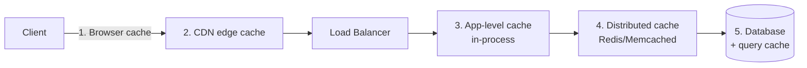
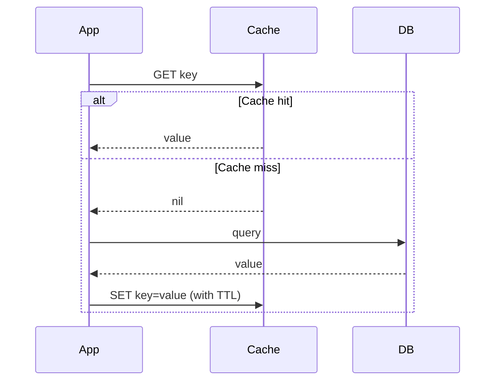

# Caching

Caching stores frequently accessed data in a faster medium (memory) to
avoid recomputing or refetching it from a slower source (disk, database,
network). It's the single highest-leverage technique for improving
latency and reducing load on backend systems.

## Where caches live

1. **Client-side** (browser cache, mobile app cache)
2. **CDN** — caches static/semi-static content at edge locations
3. **In-process/local cache** — fastest, but not shared across instances
   and causes inconsistency across a fleet
4. **Distributed cache** (Redis, Memcached) — shared across all app
   servers, the most common "cache layer" in interviews
5. **Database-level cache** (buffer pool, query cache)

## Cache-aside (lazy loading) — most common pattern

- App checks cache first; on miss, reads from DB and populates cache.
- **Pros**: only requested data is cached; cache failure is non-fatal
  (falls back to DB).
- **Cons**: first request for any key is always a miss (cold-start
  latency); possible brief staleness.

## Write-through
Write goes to the cache *and* the DB synchronously (as one operation)
before acknowledging the client.
- **Pros**: cache is never stale.
- **Cons**: extra write latency; cache fills with data that may never
  be read.

## Write-behind (write-back)
Write goes to the cache immediately; DB is updated asynchronously later.
- **Pros**: very low write latency.
- **Cons**: risk of data loss if the cache crashes before flushing to DB.

## Eviction policies
- **LRU** (Least Recently Used) — most common default, evicts the item
  not accessed for longest.
- **LFU** (Least Frequently Used) — evicts the least-accessed item;
  better when access frequency, not recency, predicts future use.
- **FIFO** — evicts oldest inserted item regardless of use.
- **TTL-based expiry** — every entry expires after a fixed time,
  regardless of access pattern (good for data with a natural staleness
  bound, e.g., "prices refresh every 60s").

## Key problems to know about (interviewers love these)
- **Cache stampede / thundering herd**: a hot key expires and thousands
  of requests simultaneously miss and hit the DB at once. Mitigations:
  - Lock/single-flight: only one request recomputes, others wait
  - Probabilistic early expiration (recompute slightly before TTL ends)
  - Serve stale data while recomputing in the background
- **Cache penetration**: repeated requests for a key that *doesn't exist*
  in the DB, bypassing the cache every time. Mitigation: cache the
  "not found" result too (with a short TTL), or use a Bloom filter to
  reject known-nonexistent keys before hitting the DB.
- **Hot key problem**: one extremely popular key (e.g., a viral post)
  overwhelms a single cache node. Mitigation: replicate the hot key
  across multiple cache nodes, or add a local in-process cache layer in
  front of the distributed cache for the hottest keys.

## Cache invalidation strategies
- **TTL expiry** — simplest, accept some staleness.
- **Explicit invalidation** — delete/update the cache key when the
  underlying data changes (requires care to avoid race conditions
  between DB write and cache invalidation — a common bug: invalidating
  the cache *before* the DB write completes leaves a stale value cached
  by a concurrent reader).
- **Write-through** — always fresh, at write-latency cost (above).

## Interview tip
Always specify: what's being cached, the key structure, TTL, eviction
policy, and how staleness is handled for *that specific* piece of data —
generic "we'll add a cache" answers score poorly.

## Related
- [CDN](cdn.md)
- [Consistent hashing](consistent-hashing.md) (for sharding a cache cluster)
- [Distributed Cache case study](../05-case-studies/design-distributed-cache.md)