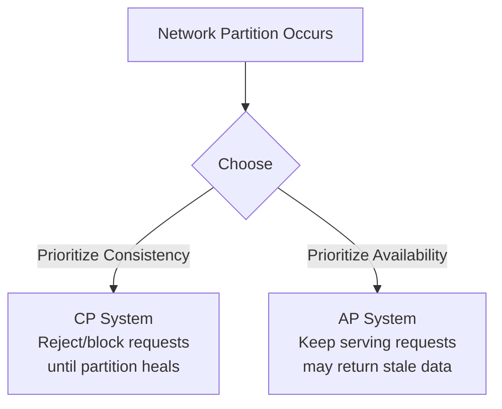

# CAP Theorem (and PACELC)

## The theorem
In a distributed system, during a **network partition**, you must choose
between:

- **C — Consistency**: every read gets the most recent write (or an error)
- **A — Availability**: every request gets a (non-error) response, though
  not guaranteed to be the most recent write

You get at most 2 of {Consistency, Availability, Partition tolerance} —
but partitions *will* happen in any real distributed system, so in
practice **P is not optional**. The real choice is **C vs A when a
partition occurs.**

## CP systems (Consistency + Partition tolerance)
Sacrifice availability during a partition — nodes that can't confirm
they have the latest data refuse to respond.
- Examples: HBase, MongoDB (in certain configs), ZooKeeper, etcd,
  traditional RDBMS with synchronous replication
- Use for: financial transactions, leader election, configuration
  management, inventory/booking systems

## AP systems (Availability + Partition tolerance)
Keep responding even if some nodes are cut off — may return stale data,
reconciled later.
- Examples: Cassandra, DynamoDB, CouchDB, Riak
- Use for: shopping carts, social feeds, product catalogs, session stores

## A common misconception
CAP only applies **during an actual network partition**. Most of the
time there's no partition, and a system can be both consistent and
available. CAP tells you what to sacrifice *only when things go wrong*,
not how the system behaves normally — that nuance is exactly why PACELC
was introduced.

## PACELC — the more complete model
**P**artition: **A**vailability vs **C**onsistency (as in CAP)
**E**lse (no partition): **L**atency vs **C**onsistency

Even without a partition, you trade off latency vs consistency: waiting
for all replicas to confirm a write (strong consistency) costs latency;
returning immediately after writing to one node (lower latency) risks
serving stale reads.

| System | Partition: | Else (normal ops): |
|---|---|---|
| DynamoDB, Cassandra | AP | EL (favors low latency) |
| MongoDB (default) | CP | EC (favors consistency) |
| MySQL (sync replication) | CP | EC |
| Cassandra tunable (QUORUM) | Tunable per-query | Tunable per-query |

## Interview tip
Don't just say "I'll use an AP database." Explain **which specific
operations** need strong consistency (checkout, payment) vs which can be
eventually consistent (viewing product listings), and consider using a
system with **tunable consistency** (like Cassandra's `QUORUM`/`ONE`
read/write levels, or DynamoDB's strongly-consistent read option) so
different operations can choose their own point on the trade-off.

## Related
- [Consistency models](consistency-models.md)
- [Replication](../02-building-blocks/replication.md)