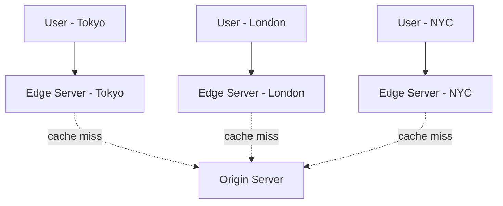

# CDN (Content Delivery Network)

A geographically distributed network of proxy servers ("edge servers" /
"PoPs" — points of presence) that cache content close to users to reduce
latency and offload the origin server.

## Why use a CDN
- **Latency**: content served from a nearby edge node instead of a
  potentially distant origin.
- **Origin offload**: origin server handles far fewer requests (only
  cache misses / dynamic content).
- **Resilience**: absorbs traffic spikes (viral content, DDoS) before it
  reaches the origin.

## Push vs Pull CDN
- **Pull (most common)**: CDN fetches content from origin on first
  request (cache miss), caches it for subsequent requests, expires per
  TTL. Simple — no need to pre-upload content.
- **Push**: you proactively upload content to the CDN ahead of time.
  Useful for large media libraries with infrequent changes, or content
  you want live before first request.

## What to put on a CDN
- Static assets: images, CSS, JS, fonts
- Video/audio segments (see [video streaming case
  study](../05-case-studies/design-video-streaming.md))
- API responses that are cacheable and don't vary per-user (e.g., public
  product catalog pages)
- Even dynamic content in some cases, using edge compute (Cloudflare
  Workers, Lambda@Edge) to personalize at the edge

## Cache invalidation on a CDN
- **TTL-based**: simplest — content expires naturally.
- **Cache-busting via versioned URLs**: `app.v2.js` or
  `app.js?hash=abc123` — new deploy = new URL = automatic
  "invalidation" (old cached version simply isn't requested anymore).
- **Explicit purge/invalidation API**: tell the CDN to evict a specific
  path immediately (slower propagation, used for urgent corrections).

## Interview tip
When your design involves images/video/static assets served to many
users globally, say "I'll put this behind a CDN" and specify what's
cached, the TTL, and the invalidation strategy for when content updates
(especially important in case studies like Instagram/YouTube/Netflix).

## Related
- [Caching](caching.md)
- [Video Streaming case study](../05-case-studies/design-video-streaming.md)
- [Instagram case study](../05-case-studies/design-instagram.md)