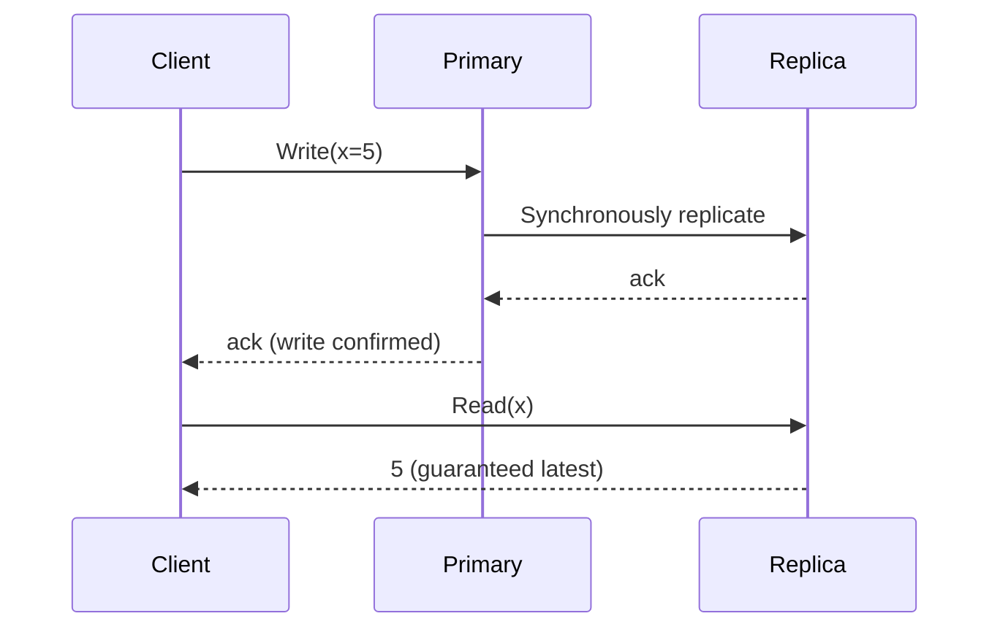
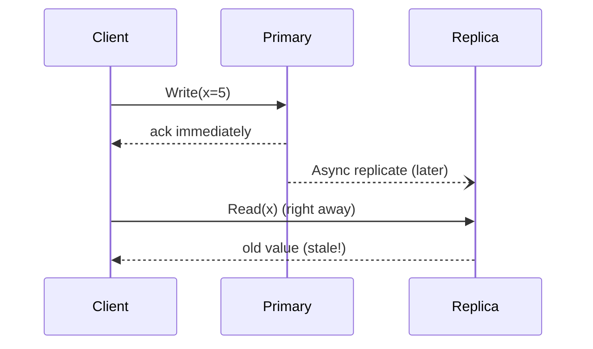

# Consistency Models

When data is replicated across multiple nodes, "consistency" describes
what guarantees you get about seeing the latest write.

## Strong consistency
Every read receives the most recent write. Behaves as if there's a single
copy of the data, even though it's replicated.

- **Use when**: correctness matters more than latency — bank balances,
  inventory counts, booking seats.
- **Cost**: higher write latency (must wait for replicas to ack),
  reduced availability during partitions (per CAP).

## Eventual consistency
Replicas converge to the same value *eventually*, but a read right after
a write might return stale data.

- **Use when**: availability/latency matters more than freshness — social
  media likes/view counts, DNS, product reviews, follower counts.
- **Cost**: application must tolerate/reconcile stale reads.

## Causal consistency
If operation A happens-before operation B (B saw A's effect), every node
sees A before B. Unrelated operations can be seen in any order. A good
middle ground for things like comment threads (a reply should never
appear before the comment it replies to).

## Read-your-writes consistency
A specific guarantee: after a user writes data, that same user's
subsequent reads will always reflect their own write (even if other
users might still see stale data). Common approach: route a user's reads
to the primary/same replica for a short window after they write.

## Monotonic reads
Once a client has seen a value, it will never see an older value on
subsequent reads (even if it hits different replicas).

## Comparing the models

| Model | Freshness guarantee | Latency | Typical use |
|---|---|---|---|
| Strong | Always latest | High | Payments, inventory, auth |
| Causal | Preserves cause→effect order | Medium | Comments/threads, collaborative editing |
| Read-your-writes | Own writes visible to self | Medium | Profile edits, posting content |
| Eventual | Converges "eventually" | Low | Likes, view counts, feeds, DNS |

## Interview tip
Don't just say "I'll use eventual consistency for scalability." Name
*which specific data* needs strong consistency (e.g., "seat inventory
during checkout must be strongly consistent to avoid double-booking")
versus what can be eventually consistent (e.g., "the 'seats remaining'
counter shown while browsing can be eventually consistent"). This
per-data-type reasoning is what distinguishes strong answers.

## Related
- [CAP theorem](cap-theorem.md)
- [Replication](../02-building-blocks/replication.md)