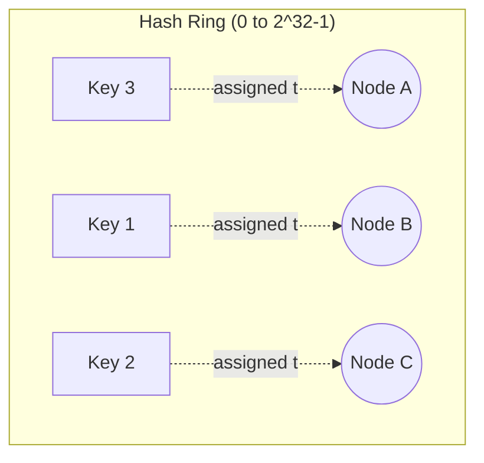
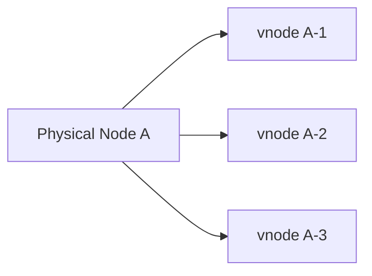

# Consistent Hashing

## The problem it solves
Naive sharding with `hash(key) % N` breaks badly when `N` (number of
nodes) changes — adding or removing **one** node remaps almost **every**
key to a different node, causing a massive, unnecessary data
migration/cache invalidation.

## The idea
Map both **nodes** and **keys** onto the same circular hash space (a
"ring," e.g., 0 to 2³²−1). A key is assigned to the first node found by
walking clockwise from the key's position on the ring.

When a node is **added**, it only takes over the portion of the ring
between itself and the previous node — only those keys move; everything
else is untouched. When a node is **removed**, only its keys move to the
next node clockwise. This bounds data movement to roughly `K/N` keys
(K = total keys, N = nodes) instead of nearly all of them.

## Virtual nodes (a critical refinement)
With only one point per physical node on the ring, distribution can be
very uneven (some nodes get much bigger arcs than others by chance).
Solution: each physical node is represented by **many** virtual points
on the ring (e.g., 100–200 per node), spread around it.

This smooths out load distribution and means when a physical node is
removed, its load is spread across *many* other nodes rather than
dumping it all onto one neighbor.

## Where consistent hashing is used
- **Distributed caches** (Memcached client libraries, Redis Cluster
  slot-based variant)
- **Distributed databases** (Cassandra, DynamoDB use it for data
  partitioning across nodes)
- **Load balancers** (routing the same client consistently to the same
  backend — "sticky" routing without a central session store)
- **CDNs** (mapping content to edge caches)

## Replication with consistent hashing
Instead of storing a key on just the first node clockwise, store it on
the first **N distinct physical nodes** clockwise (the key's
"preference list") — this gives replication for free from the same
mechanism (this is exactly how DynamoDB/Cassandra work).

## Interview tip
Consistent hashing is a very common **follow-up** to "how would you
shard your cache/database" — mention virtual nodes explicitly, since
"consistent hashing" alone without vnodes is an incomplete answer that
interviewers will probe on.

## Related
- [Database sharding](database-indexing-sharding.md)
- [Load balancing](load-balancing.md)
- [Distributed Cache case study](../05-case-studies/design-distributed-cache.md)