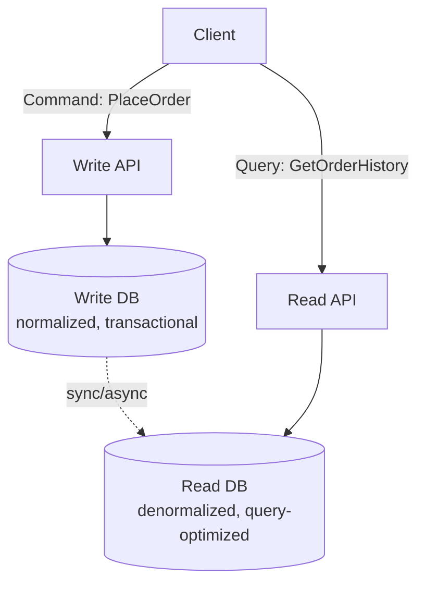
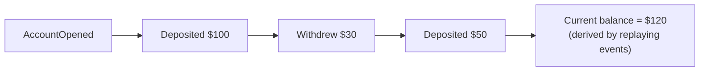
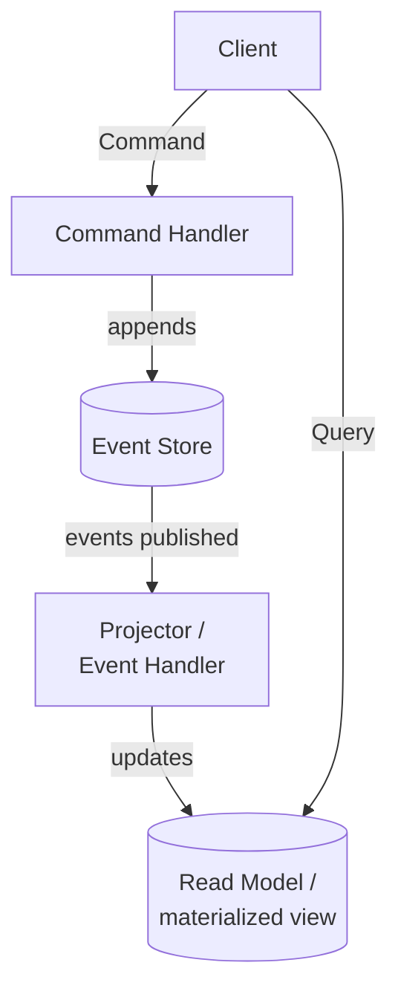

# CQRS & Event Sourcing

## CQRS (Command Query Responsibility Segregation)
Separate the **write model** (commands that change state) from the
**read model** (queries that fetch state) — they can even use entirely
different data stores, optimized independently.

**Why**: read and write workloads often have very different
requirements — writes need strong consistency/validation, reads need to
be fast and often denormalized/joined across entities for display. Read
replicas, materialized views, or a wholly different database (e.g.,
Elasticsearch for search-shaped reads) can serve the read side without
constraining the write side's schema.

**Costs**: added complexity (two models to maintain, keep in sync),
usually introduces eventual consistency between write and read sides
(a write may not be immediately visible on the read side).

**When to use**: read and write patterns are very different, or read
scale is much higher than write scale (common in social feeds,
dashboards, reporting). **Don't** apply this to simple CRUD — it's
overkill and adds unjustified complexity.

## Event Sourcing
Instead of storing just the current state, store the full sequence of
**events** that led to it. Current state is derived by replaying events.

**Pros**:
- Full audit trail / history for free — you can answer "what was the
  state at any point in time?"
- Enables temporal queries and debugging ("replay events up to
  yesterday to see what the balance was").
- Natural fit with event-driven architectures — the event log *is* the
  source of truth other services can also subscribe to.

**Cons**:
- Replaying the full event history to get current state is slow at
  scale → mitigate with **snapshots** (periodically persist the
  computed state so you only replay events since the last snapshot).
- Querying "current state" directly is awkward — usually paired with
  CQRS (event store for writes, a materialized read model for queries).
- Schema evolution of events over time needs care (old events must
  still be replayable after code changes).

## CQRS + Event Sourcing together (common combo)

## Interview tip
These patterns come up when a case study needs strong auditability
(financial ledgers, banking) or when read/write scaling needs diverge
sharply (a news feed with millions of reads per write). Mention them by
name **and** the specific trade-off (eventual consistency between write
and read sides) rather than presenting them as free wins.

## Related
- [Event-driven architecture](event-driven-architecture.md)
- [Twitter/News Feed case study](../05-case-studies/design-twitter.md)