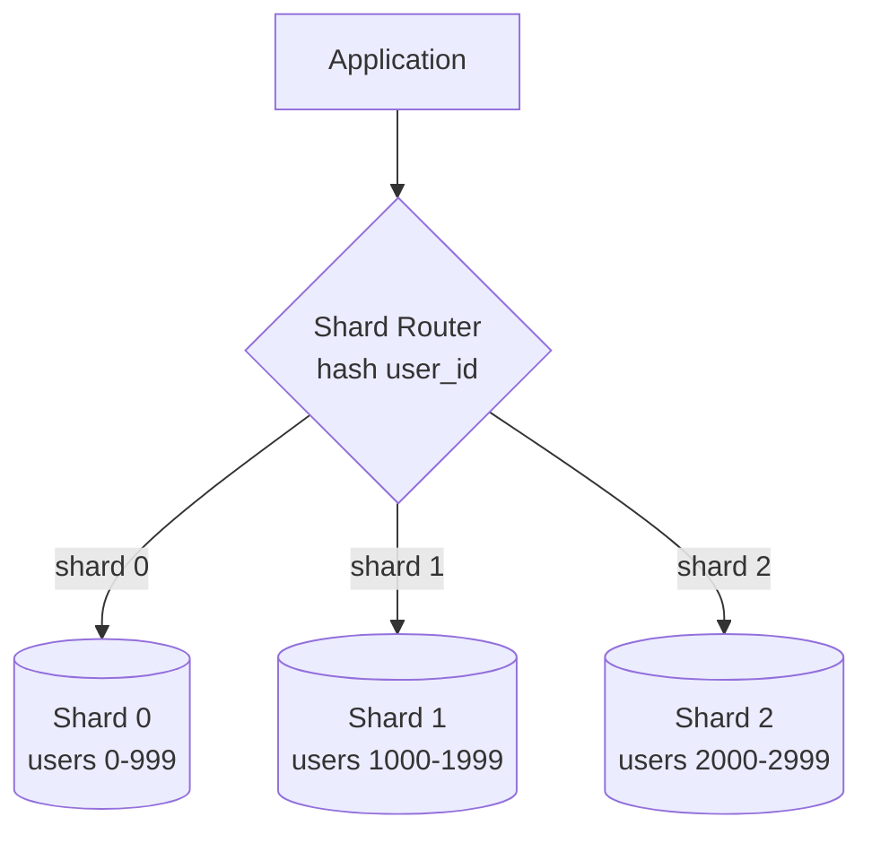

# Database Indexing & Sharding

## Indexing
An index is an auxiliary data structure (usually a B-tree or hash table)
that lets the database find rows without scanning the whole table.

```mermaid
graph LR
    Q[Query: WHERE email = 'x@y.com'] --> Idx[Index on 'email'<br/>B-Tree]
    Idx -->|O(log n) lookup| Row[Row pointer]
    Row --> Table[(Full row in table)]
```

- **B-Tree index**: default for most relational DBs — great for range
  queries (`WHERE age > 25`) and equality.
- **Hash index**: O(1) equality lookups, but no range query support.
- **Composite index**: index on multiple columns, e.g., `(user_id,
  created_at)` — order matters; it speeds up queries filtering on
  `user_id` alone or `user_id + created_at`, but not `created_at` alone.
- **Covering index**: index includes all columns the query needs, so the
  DB never touches the actual table (fastest possible read).

**Trade-off**: every index speeds up reads but slows down writes (the
index must be updated on every insert/update/delete) and takes extra
storage. Don't over-index — index the columns actually used in
`WHERE`/`JOIN`/`ORDER BY` clauses of hot queries.

## Sharding (horizontal partitioning)
Splitting one large table/dataset across multiple database nodes, each
holding a subset of the rows.



### Sharding strategies
| Strategy | How | Pros | Cons |
|---|---|---|---|
| Range-based | Shard by key range (e.g., A–M, N–Z) | Simple, good for range scans | Hotspots if data/access is skewed |
| Hash-based | `hash(key) % N` or consistent hashing | Even distribution | Range queries need scatter-gather across all shards |
| Directory-based | Lookup service maps key → shard | Flexible, easy rebalancing | Extra hop + the directory becomes a critical dependency |
| Geo-based | Shard by user region | Low latency, data locality/compliance | Cross-region queries are expensive |

### Choosing a shard key
The shard key determines the distribution — pick a key that:
- Distributes load evenly (avoid a key correlated with a "hot" entity)
- Matches your most common query pattern (so most queries hit one shard,
  not all of them — avoid "scatter-gather" queries when possible)

Example: sharding a chat app's messages by `conversation_id` (not
`message_id`) so that fetching a conversation's history hits one shard.

### Problems sharding introduces
- **Joins across shards** are expensive/impossible — denormalize or do
  joins in the application layer.
- **Rebalancing**: adding/removing shards means moving data — use
  **consistent hashing** to minimize data movement (see
  [consistent-hashing.md](consistent-hashing.md)).
- **Cross-shard transactions**: need distributed transaction protocols
  (2PC) or the [Saga pattern](../03-architecture-patterns/saga-pattern.md).
- **Celebrity/hotspot problem**: some shard keys (e.g., a viral user) get
  far more traffic than others — mitigate with further sub-partitioning
  or a dedicated shard for known hot entities.

## Vertical partitioning (a related, different idea)
Splitting a table **by column** instead of by row — e.g., moving rarely
accessed large columns (like a user's bio/profile picture blob) into a
separate table/store so the frequently accessed columns (name, email)
stay in a small, fast-to-scan table.

## Interview tip
When you propose sharding, always state: (1) the shard key and why, (2)
how many shards / rebalancing strategy, (3) which queries become harder
(cross-shard joins/transactions) and how you'll handle them.

## Related
- [Consistent hashing](consistent-hashing.md)
- [Replication](replication.md)
- [SQL vs NoSQL](databases-sql-vs-nosql.md)