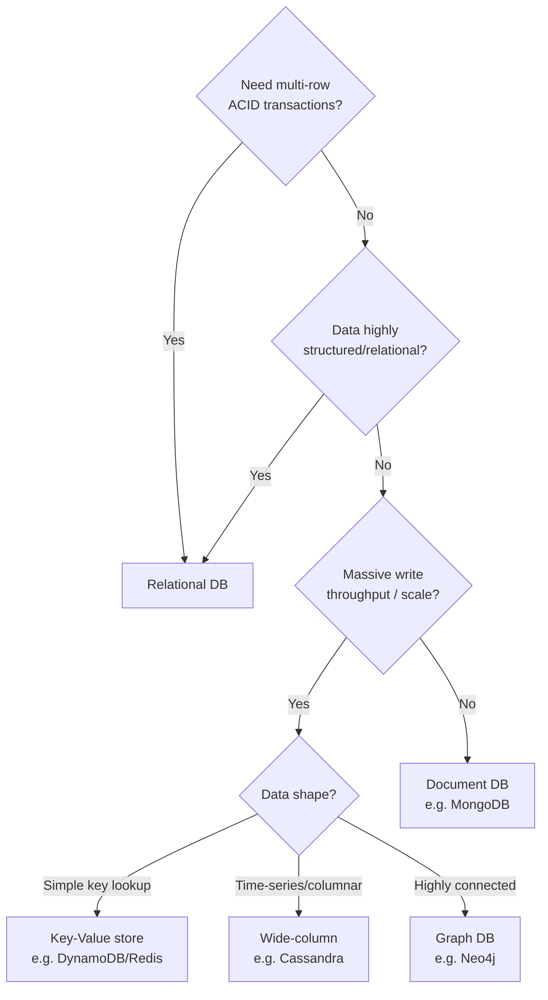

# SQL vs NoSQL

## Relational (SQL) databases
Structured tables with fixed schemas, relationships enforced via foreign
keys, and ACID transactions.
- **Examples**: PostgreSQL, MySQL, SQL Server, Oracle
- **Strengths**: complex queries/joins, strong consistency, mature
  tooling, transactional integrity
- **Weaknesses**: harder to horizontally scale writes (though sharding,
  read replicas mitigate this); schema changes can be costly at scale

### ACID
- **Atomicity**: transaction is all-or-nothing
- **Consistency**: transaction moves DB from one valid state to another
  (constraints/invariants always hold)
- **Isolation**: concurrent transactions don't interfere (see isolation
  levels below)
- **Durability**: once committed, survives crashes

### Isolation levels (weakest → strongest)
| Level | Prevents |
|---|---|
| Read Uncommitted | Nothing — dirty reads possible |
| Read Committed | Dirty reads |
| Repeatable Read | Dirty + non-repeatable reads |
| Serializable | All anomalies — behaves as if transactions ran one at a time |

Stronger isolation = more locking = lower throughput. Most production
systems default to **Read Committed** and use explicit locking/optimistic
concurrency where stronger guarantees matter.

## NoSQL databases
Non-relational, more flexible schema, generally trades some consistency
or query flexibility for horizontal scalability and higher write
throughput.

| Type | Data model | Examples | Best for |
|---|---|---|---|
| Key-Value | key → opaque value | Redis, DynamoDB, Memcached | Caching, sessions, simple lookups |
| Document | key → JSON/BSON doc | MongoDB, Couchbase | Semi-structured data, flexible schema, nested objects |
| Wide-column | row key → column families | Cassandra, HBase, Bigtable | High write throughput, time-series, huge datasets |
| Graph | nodes + edges | Neo4j, Amazon Neptune | Highly connected data — social graphs, recommendations |

**Strengths**: horizontal scalability built in, flexible schema, high
write throughput, often tunable consistency
**Weaknesses**: weaker/no multi-record transactions (improving in modern
versions), joins are the application's job, eventual consistency by
default in many

## Decision framework

## Polyglot persistence
Real systems almost always use **multiple** databases, each suited to a
specific access pattern within the same product:
- Postgres for user accounts/billing (needs transactions)
- Redis for session/cache
- Cassandra for event/activity logs (huge write volume)
- Elasticsearch for search
- S3/blob store for media files

## Interview tip
Never say "I'll use NoSQL because it scales better" as a blanket
statement — SQL databases scale very well too (read replicas, sharding,
Vitess/CockroachDB). Justify the choice by the **access pattern**: query
complexity needed, consistency requirements, write volume, and whether
the schema is naturally relational.

## Related
- [Database indexing & sharding](database-indexing-sharding.md)
- [Replication](replication.md)
- [CAP theorem](../01-fundamentals/cap-theorem.md)