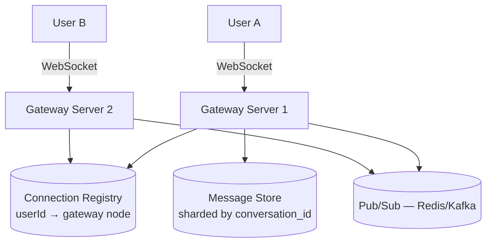
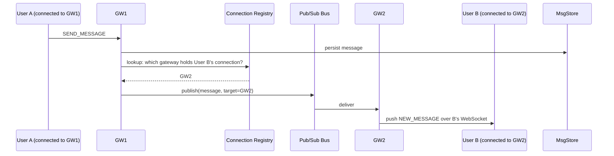

# Design a Chat System (WhatsApp / Messenger)

## 1. Requirements
**Functional**
- 1:1 messaging and group chat
- Message delivery status (sent/delivered/read)
- Online/offline presence indicator
- Message history persists and syncs across devices

**Non-functional**
- Low latency delivery (near real-time)
- Messages must not be lost, even if the recipient is offline
- Must scale to hundreds of millions of concurrent connections
- Ordering matters within a conversation

## 2. Estimation
- Assume 500M DAU, each sends ~50 messages/day → 25B messages/day →
  ~290,000 messages/sec average
- Each message might be small (~100 bytes text) but multiplied by scale
  → meaningful bandwidth and huge message-storage volume over time
- Concurrent WebSocket connections: if 20% of DAU is online
  simultaneously at peak → **100M concurrent persistent connections** —
  this number alone tells you connection management is a first-class
  architectural concern, not an afterthought.

## 3. API / protocol
Real-time delivery uses **WebSockets** (see [real-time
communication](../02-building-blocks/realtime-communication.md)), not
REST polling — messaging needs low-latency, bidirectional, unsolicited
server push.
```
WS event: SEND_MESSAGE   { conversationId, senderId, text, clientMsgId }
WS event: MESSAGE_ACK    { messageId, status: delivered|read }
WS event: NEW_MESSAGE     (server push to recipient)
WS event: PRESENCE_UPDATE { userId, status: online|offline }
```

## 4. Data model
```
messages       message_id (PK), conversation_id, sender_id, content,
               created_at, status
conversations  conversation_id (PK), participant_ids[], last_message_at
```
Shard `messages` by `conversation_id` — this is the dominant access
pattern (fetch a conversation's history), so it should always resolve
to a single shard.

## 5. High-level design


## 6. Deep dive: routing a message to an online recipient
Since User A and User B's WebSocket connections may be held by
*different* gateway server instances, delivering a message requires
knowing which instance holds the recipient's connection.

The **connection registry** (a fast KV store, e.g., Redis: `userId →
gatewayInstanceId`) is updated whenever a user connects/disconnects.
This is the piece that makes WebSockets horizontally scalable — see
[real-time communication](../02-building-blocks/realtime-communication.md#scaling-websockets-across-multiple-servers).

## 7. Deep dive: offline delivery
If the recipient isn't currently connected (not in the registry, or the
publish to their gateway fails):
- Message is still persisted in the message store (durability first).
- On the recipient's next connect, the client syncs: "give me all
  messages since my last-seen message ID/timestamp per conversation" —
  a pull-based catch-up, rather than the server trying to track and
  push a backlog actively.
- Push notification (via [APNs/FCM](design-notification-system.md)) can
  alert the user's device even while the app isn't in the foreground.

## 8. Deep dive: message ordering & delivery guarantees
- Within one conversation, order matters — assign each message a
  monotonically increasing sequence number *per conversation* (not
  globally), so clients can detect gaps/out-of-order delivery and
  re-sync if needed.
- **At-least-once delivery + client-side dedup**: the client generates a
  `clientMsgId` when composing a message; if the network hiccups and the
  client retries sending, the server can recognize the duplicate
  `clientMsgId` and avoid creating a second message.
- **Delivery status**: `sent` (server received it) → `delivered`
  (recipient's device received it) → `read` (recipient viewed it) — each
  transition is its own event, acknowledged back to the sender,
  typically via the same WebSocket/pub-sub path in reverse.

## 9. Deep dive: group chat fan-out
For a group of size K, one message must be delivered to all K
participants — conceptually a small-scale fan-out-on-write (see
[Twitter's feed fan-out](design-twitter.md) for the same underlying
idea at a different scale): the gateway that receives the message
publishes it once per online participant (via the connection registry
lookup above), and persists it once in the shared conversation history
that all members read from.

## 10. Deep dive: presence (online/offline)
- On connect, mark `userId` online in a fast store (with a TTL,
  refreshed by periodic heartbeats from the client) — if the heartbeat
  stops (connection drops without a clean disconnect), presence
  naturally expires to offline after the TTL.
- Presence updates are broadcast only to relevant contacts (not
  globally) — typically pushed to users who have that person in an
  active conversation view, to avoid a global fan-out for every
  connect/disconnect across hundreds of millions of users.

## 11. Bottlenecks & scaling
- **Connection registry** must handle lookups/updates at the scale of
  concurrent connections (100M+) with low latency — a sharded, in-memory
  store (Redis Cluster) is standard.
- **Gateway server capacity**: each WebSocket connection consumes some
  memory/file-descriptor overhead — capacity-plan gateway instance count
  based on concurrent connections per instance (commonly tens of
  thousands per instance with efficient async I/O).
- **Message store sharding** by `conversation_id` keeps the hot path
  (fetch/append to one conversation) single-shard, at the cost of
  needing a secondary index/lookup if you need cross-conversation
  queries (e.g., "all conversations for user X" — typically a separate,
  smaller `conversations` table/index keyed by participant).

## Related
- [Real-time communication (WebSockets, SSE)](../02-building-blocks/realtime-communication.md)
- [Message queues](../02-building-blocks/message-queues.md)
- [Notification System case study](design-notification-system.md)