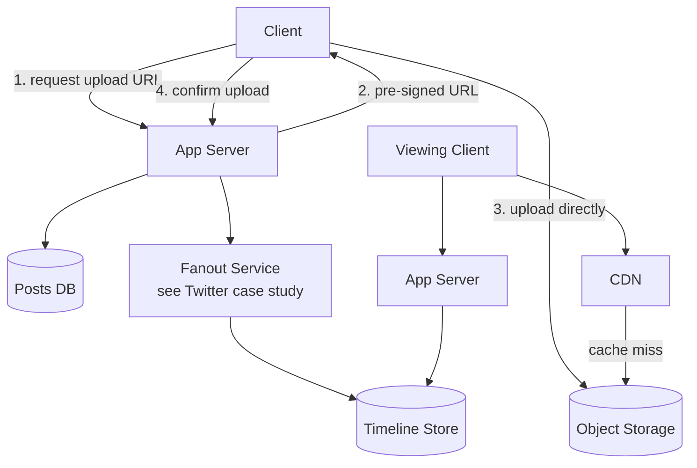
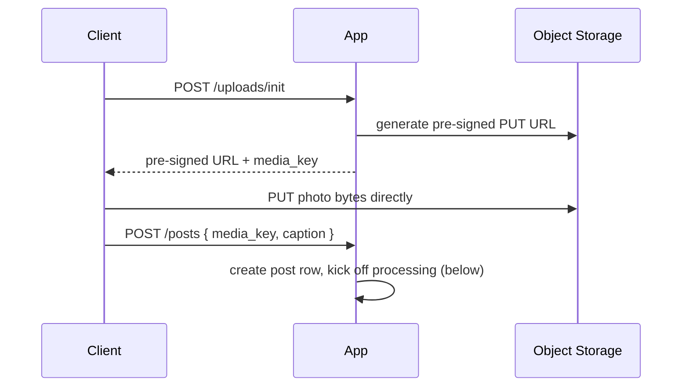
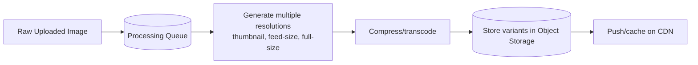

# Design Instagram

Shares the feed-generation problem with [Twitter](design-twitter.md)
(fan-out-on-write vs read), but the interesting deep dive here is
**media (photo/video) storage and delivery** — a distinct problem worth
its own treatment.

## 1. Requirements
**Functional**
- Upload a photo/video with a caption
- View a home feed of posts from followed accounts
- Like/comment on posts
- View a user's profile grid of their own posts

**Non-functional**
- Photo/video upload and viewing must feel fast globally
- Storage grows enormously — must be cost-efficient at scale
- Read-heavy (viewing >> posting), similar to Twitter

## 2. Estimation
- Assume 500M DAU, each uploads ~1 photo/week on average → ~70M
  uploads/day → ~800 uploads/sec average
- Each user views ~100 photos/day in feed → 50B photo views/day →
  ~580,000 views/sec average — this dwarfs upload volume, confirming
  read-heavy skew
- Average photo size ~200KB (post-compression) → 70M × 200KB ≈ 14TB new
  photo data/day → ~5PB/year — this alone justifies dedicated **object
  storage**, not a database, for media.

## 3. API
```
POST /posts          { userId, mediaFile, caption }
GET  /feed?userId=123&cursor=...
GET  /users/{id}/posts
POST /posts/{id}/like
```

## 4. Data model
```
posts       post_id (PK), user_id, media_key, caption, created_at
follows     follower_id, followee_id
timelines   user_id (PK), [post_id, ...]     -- precomputed, see Twitter case study
likes       post_id, user_id                  -- composite key
```
Media itself never lives in these tables — only a `media_key` pointing
into object storage.

## 5. High-level design


## 6. Deep dive: media upload path
Client never uploads the actual bytes through the app server — use a
**pre-signed URL** so the client uploads directly to object storage,
saving app-server bandwidth/CPU entirely (see [object
storage](../02-building-blocks/object-storage.md)):


## 7. Deep dive: media processing pipeline
After upload, an async pipeline (triggered by an object-storage event
or an explicit "upload complete" call) generates what's actually served:

- Multiple resolutions are pre-generated (not on-demand) so serving is
  just a cache/CDN lookup, never live image processing on the read
  path.
- Client requests the appropriately-sized variant for its context
  (thumbnail in a grid, full-size when opened) — saves bandwidth on
  mobile.

## 8. Deep dive: serving media at scale
- **CDN in front of object storage** for all media — the vast majority
  of views hit the CDN edge cache, never reaching the origin object
  store (see [CDN](../02-building-blocks/cdn.md)).
- **Image URLs are effectively immutable** (a new edit = a new
  media_key) — this makes them perfect, cache-forever CDN candidates
  with no invalidation complexity.

## 9. Deep dive: feed generation
Identical hybrid fan-out approach to [Twitter's news
feed](design-twitter.md#6-deep-dive-fan-out-on-write-vs-fan-out-on-read)
— fan-out-on-write for regular accounts, fan-out-on-read merge for
celebrity/high-follower accounts. Feed ranking (not just reverse-chron)
would additionally weigh engagement signals — out of scope for a first
pass, worth mentioning as a follow-up if time allows.

## 10. Bottlenecks & scaling
- **Storage cost at PB scale**: use lifecycle policies to move
  older/rarely-accessed original-resolution images to cheaper cold
  storage tiers, while keeping frequently-viewed derived resolutions
  hot.
- **Thundering herd on a viral post**: CDN + aggressive caching absorb
  this; the origin object store should rarely see a cache miss for
  popular content.
- **Like counts**: a viral post gets millions of concurrent likes — don't
  do a synchronous `UPDATE posts SET like_count = like_count + 1` under
  huge write contention; instead, batch/aggregate like events (e.g., via
  a queue + periodic counter flush, or a CRDT counter) and show an
  approximate/eventually-consistent count.

## Related
- [Object storage](../02-building-blocks/object-storage.md)
- [CDN](../02-building-blocks/cdn.md)
- [Twitter / News Feed case study](design-twitter.md)