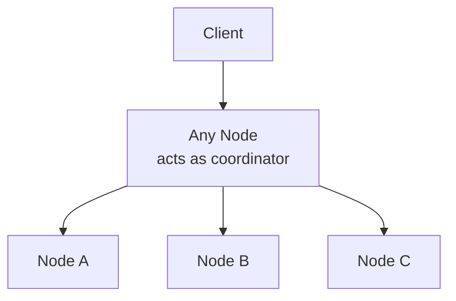
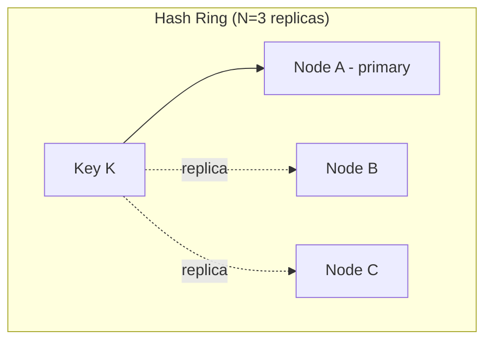
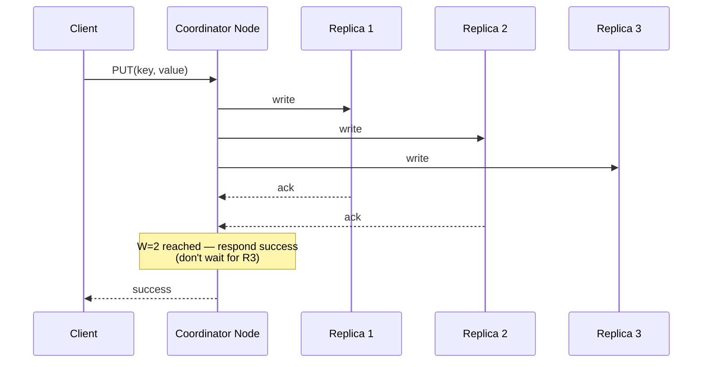

# Design a Distributed Key-Value Store (like DynamoDB/Cassandra)

This is one of the more "systems-y" interview questions — it tests
whether you understand replication, partitioning, and consistency
trade-offs deeply, since it's effectively asking you to design the
building blocks other case studies treat as a black box.

## 1. Requirements
**Functional**
- `put(key, value)` and `get(key)` — simple KV interface
- Handle node failures without data loss or downtime

**Non-functional**
- Horizontally scalable (add nodes to increase capacity)
- Highly available (favor availability over strict consistency — an AP
  system, per [CAP theorem](../01-fundamentals/cap-theorem.md))
- Tunable consistency per operation is a nice-to-have (like DynamoDB)

## 2. High-level design

Leaderless — any node can act as the coordinator for a given request,
forwarding to the nodes that actually own the relevant data.

## 3. Partitioning: consistent hashing
Keys are distributed across nodes using **consistent hashing with
virtual nodes** (see [consistent
hashing](../02-building-blocks/consistent-hashing.md)) so that adding/
removing nodes only reshuffles a small fraction of keys.

## 4. Replication
Each key is replicated to the **N** nodes following it clockwise on the
hash ring (its "preference list"), so losing any single node doesn't
lose data.

## 5. Tunable consistency: quorum reads/writes
Define:
- **N** = total replicas for a key
- **W** = number of nodes that must acknowledge a write before it's
  considered successful
- **R** = number of nodes that must respond to a read before returning a
  result

If **W + R > N**, every read is guaranteed to overlap with the latest
write's replica set → **strong consistency**. If **W + R ≤ N**, reads
may return stale data → **eventual consistency**, but lower latency and
higher availability.

| Config (N=3) | Behavior |
|---|---|
| W=3, R=1 | Strong write durability, fast reads, writes fail if any replica is down |
| W=1, R=3 | Fast writes, slower/stronger reads |
| W=2, R=2 | Balanced — tolerates 1 node down for either read or write, strong consistency (2+2 > 3) |
| W=1, R=1 | Fastest for both, weakest consistency ("ONE" in Cassandra terms) |

This lets **each client/operation choose its own point** on the
consistency-latency trade-off — critical-path writes (e.g., inventory)
use higher W/R; low-stakes writes (e.g., a "last seen" timestamp) use
W=1/R=1.

## 6. Conflict resolution — what happens with concurrent writes?
With multiple replicas and no single leader, two clients can write to
different replicas concurrently, creating conflicting versions.
- **Last-Write-Wins (LWW)**: attach a timestamp, keep the newest —
  simple, but can silently drop a legitimate concurrent write (clock
  skew makes "newest" unreliable across nodes).
- **Vector clocks**: track causal history per key/replica so the system
  can detect *true* concurrent writes (as opposed to one being a causal
  descendant of the other) and surface **both** versions to the
  application/client to resolve (this is DynamoDB's original approach,
  and Cassandra's approach for some data types) — more complex, but
  correct.
- **CRDTs (Conflict-free Replicated Data Types)**: data structures
  (counters, sets, etc.) specifically designed so concurrent updates
  merge deterministically without conflict, avoiding the need for
  manual resolution for supported data shapes.

## 7. Handling node failure: hinted handoff + read repair
- **Hinted handoff**: if a replica node is temporarily down during a
  write, another node stores a "hint" (the write, tagged for the down
  node) and delivers it once that node recovers — keeps writes
  succeeding despite transient failures without permanently losing the
  intended replica placement.
- **Read repair**: when a read notices replicas disagree (stale
  replica), it triggers a background write to bring the stale replica
  up to date — spreads consistency-repair work across normal read
  traffic instead of a dedicated repair process alone.
- **Anti-entropy / Merkle trees**: periodic background comparison of
  replica contents (using Merkle tree hashes to efficiently find
  *which* keys differ without comparing every key) to catch and repair
  any divergence read-repair missed.

## 8. Write path (put)

## 9. Bottlenecks & further considerations
- **Gossip protocol** for cluster membership: nodes periodically
  exchange state with random peers so every node eventually learns
  about joins/leaves/failures without a central registry.
- **Compaction** (for LSM-tree-based storage engines, common in these
  systems): background merging of on-disk sorted files to reclaim space
  from overwritten/deleted keys and keep read performance from
  degrading over time.

## Related
- [Consistent hashing](../02-building-blocks/consistent-hashing.md)
- [CAP theorem](../01-fundamentals/cap-theorem.md)
- [Replication](../02-building-blocks/replication.md)
- [Distributed Cache case study](design-distributed-cache.md)