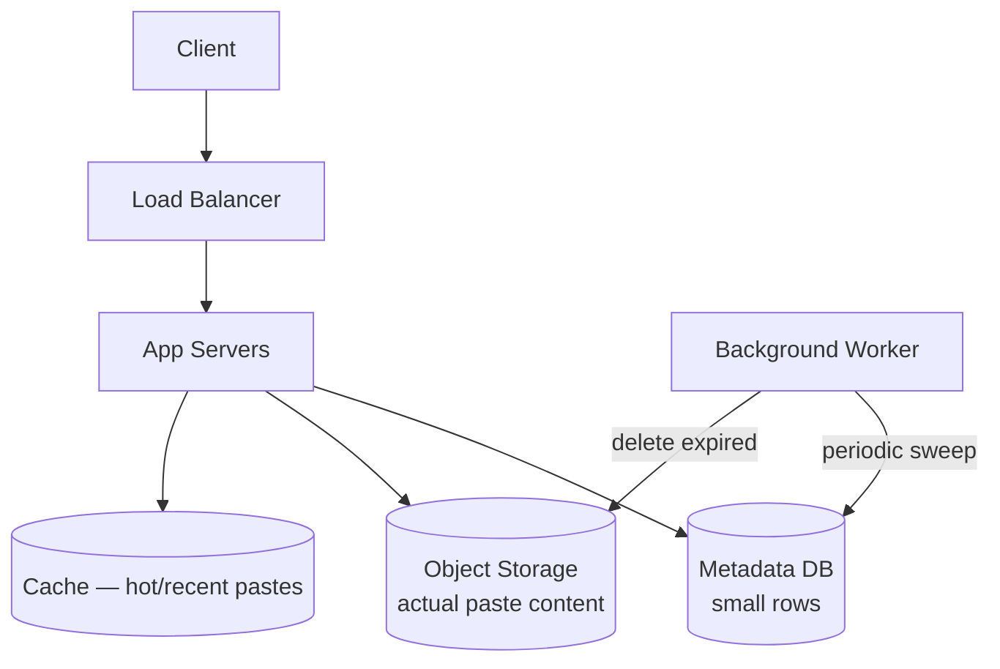

# Design Pastebin

Very similar shape to the [URL Shortener](design-url-shortener.md) —
key differences: storing much larger content (text pastes, not a single
URL) and supporting expiration as a first-class feature.

## 1. Requirements
**Functional**
- User pastes text, gets a short unique URL to share/view it
- Optional: expiration time, syntax highlighting language, custom URL,
  private (unlisted) vs public pastes

**Non-functional**
- Read-heavy (viewing >> creating), similar order of magnitude as URL
  shortener
- Pastes can be up to a few MB (unlike a URL, this is real payload
  size)
- Durability — pastes shouldn't be lost (until they expire)

## 2. Estimation
- Assume 1M new pastes/day, avg size 10KB → 10GB/day of new content →
  ~3.6TB/year
- Read:write ratio ~10:1 → 10M reads/day ≈ **115 reads/sec** average
- This is far more storage-heavy per item than a URL shortener — the
  actual paste content (not just a small string) needs a home.

## 3. API
```
POST /api/paste
  body: { content, language?, expiresIn?, isPrivate? }
  response: { pasteId, url }

GET /api/paste/{pasteId}
  response: { content, language, createdAt, expiresAt }
```

## 4. Data model
Split metadata (small, queried often) from content (large, fetched by
ID only) — a form of vertical partitioning:
```
paste_metadata
  paste_id     VARCHAR(8)  PRIMARY KEY
  content_key  VARCHAR     -- pointer into object storage
  language     VARCHAR
  created_at   TIMESTAMP
  expires_at   TIMESTAMP NULL
  is_private   BOOLEAN

-- actual paste text/content lives in object storage (S3), keyed by content_key
```

## 5. High-level design


## 6. Deep dive: why split metadata from content?
- Metadata rows are small and queried constantly (existence checks,
  listing a user's pastes) — keeping them in a lean relational/KV table
  keeps that table fast and cache-friendly.
- Content can be large (up to MBs) — storing it in **object storage**
  (S3) rather than a DB `TEXT`/`BLOB` column avoids bloating the
  database, keeps DB backups fast, and object storage is cheaper per GB
  and scales storage independently of the metadata DB. See [object
  storage](../02-building-blocks/object-storage.md).
- On paste creation: write content to object storage first, then write
  the metadata row pointing to it (if the metadata write fails, you
  have an orphaned blob — acceptable, cleaned up by a periodic garbage
  collection job; the reverse order risks metadata pointing to
  non-existent content, which is worse).

## 7. Deep dive: expiration
Two mechanisms, often combined:
- **Lazy expiration**: when a paste is requested, check `expires_at`; if
  past, return 404 and (optionally) trigger deletion. Guarantees
  expired pastes are never served, but leaves storage un-reclaimed
  until someone requests them.
- **Active expiration (background sweep)**: a periodic job (or a
  TTL-based feature of the database, e.g., Redis `EXPIRE`, or DynamoDB
  TTL) scans for and deletes expired pastes proactively, reclaiming
  storage even if nobody requests them again.
Use both: lazy check for correctness, active sweep for storage
reclamation and cost control.

## 8. Deep dive: ID generation & caching
Identical approach to the URL shortener — Base62-encoded counter for
collision-free short IDs (see that case study for the full reasoning),
and a cache-aside layer for hot/recently-created pastes (most pastes
are viewed heavily right after creation, then rarely — a classic
recency-biased access pattern well suited to an LRU cache).

## 9. Bottlenecks & scaling
- **Storage growth**: with high paste volume and large content, storage
  cost dominates — expiration policy and moving old/rarely-accessed
  pastes to cold storage tiers matters more here than in a URL
  shortener.
- **Abuse prevention**: pastebins are a common target for spam/malware
  hosting — rate limit paste creation per IP/user (see [rate
  limiting](../02-building-blocks/rate-limiting.md)) and consider
  content scanning.

## Related
- [URL Shortener case study](design-url-shortener.md)
- [Object storage](../02-building-blocks/object-storage.md)
- [Caching](../02-building-blocks/caching.md)