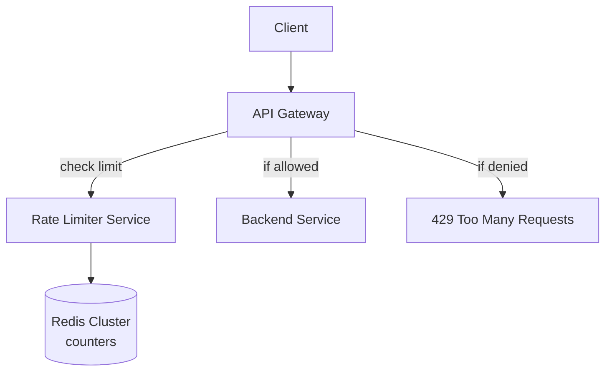
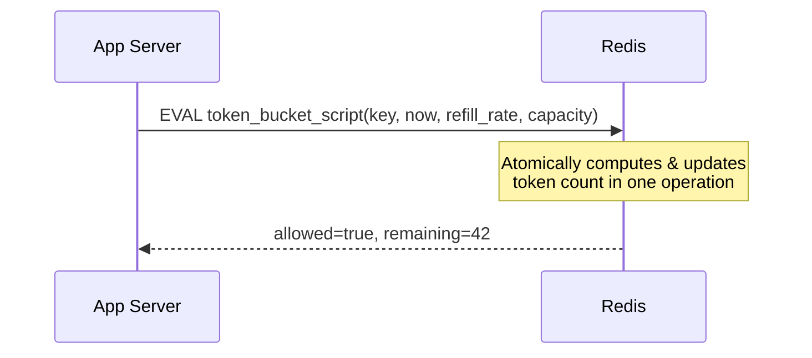

# Design a Rate Limiter

See [rate-limiting.md](../02-building-blocks/rate-limiting.md) for the
algorithms — this case study focuses on making one work as a
**distributed, shared service** across a fleet of API servers.

## 1. Requirements
**Functional**
- Limit each client (by API key or user ID) to N requests per time
  window, per endpoint (or globally)
- Reject over-limit requests with `429` and appropriate headers

**Non-functional**
- Must work correctly across many app server instances (not per-instance
  limits, which would allow N × instance-count effective throughput)
- Very low added latency (this runs on every request)
- Should fail open or gracefully degrade if the rate limiter's own
  storage is unavailable (don't take down the whole API because the
  limiter is down — decide explicitly: fail-open lets all traffic
  through temporarily; fail-closed blocks all traffic — usually
  fail-open is preferred for a rate limiter specifically, since its job
  is protection, not core correctness)

## 2. Estimation
- Assume 10,000 API servers, 1M distinct API keys, checking a limit on
  every request at 100K RPS system-wide.
- The rate limiter's own storage must handle **100K+ ops/sec** with
  sub-millisecond latency — this rules out a traditional relational DB
  and points to an in-memory store.

## 3. High-level design

The rate limiter can live as: (a) a **library** embedded in each API
server (fastest, but needs a shared backing store to be correct across
instances), or (b) a **standalone middleware/sidecar** at the API
gateway (centralized, easier to update policy without redeploying every
service) — most production systems use (b) at the gateway layer.

## 4. Algorithm choice
**Token bucket**, backed by Redis, is the standard answer:
```
key = "ratelimit:{apiKey}:{endpoint}"
```
On each request, atomically:
1. Compute tokens available = min(capacity, last_tokens + elapsed_time × refill_rate)
2. If tokens ≥ 1: decrement by 1, allow request
3. Else: reject request

This must be **atomic** (read-modify-write as one operation) to avoid
race conditions between concurrent requests from the same client hitting
different app server instances simultaneously. Implement via:
- **Redis Lua script** (`EVAL`) — the whole check-and-decrement runs
  atomically inside Redis, avoiding a race between separate GET and SET
  calls.
- Or Redis's built-in atomic commands (`INCR` + `EXPIRE` for a simpler
  fixed-window variant).



## 5. Scaling the limiter's storage itself
- **Single Redis instance**: simplest, but a single point of failure
  and eventually a throughput ceiling.
- **Redis Cluster (sharded)**: shard rate-limit keys across nodes by
  `hash(apiKey) % N` or consistent hashing — each key's counter lives
  on one shard, so no cross-node coordination needed per check (see
  [consistent hashing](../02-building-blocks/consistent-hashing.md)).
- **Local + synced counters** (for extreme scale): each app server
  keeps a local approximate counter and periodically syncs with Redis,
  trading strict accuracy for lower latency/load on the shared store —
  acceptable since rate limiting is inherently approximate at the
  margins (being off by a few requests around the boundary rarely
  matters).

## 6. Multiple rate limit tiers
Real systems often enforce several limits simultaneously — e.g.:
- 10 requests/second (burst control)
- 1,000 requests/hour (sustained usage control)
- Different limits per subscription tier (free vs paid API plans)

Check all applicable limits (each as its own key/bucket) and reject if
**any** is exceeded.

## 7. Response contract
```
HTTP/1.1 429 Too Many Requests
X-RateLimit-Limit: 1000
X-RateLimit-Remaining: 0
X-RateLimit-Reset: 1719840060
Retry-After: 42
```

## 8. Bottlenecks & edge cases
- **Redis becoming a bottleneck**: mitigate with sharding + the
  local-counter-with-sync approach above at very high scale.
- **Clock skew** across servers if not using a centralized store for
  timing — another reason to centralize the counter logic in Redis
  rather than trusting each app server's local clock independently.
- **Fail-open vs fail-closed** on limiter storage outage — explicitly
  decide and state this trade-off; for most APIs, fail-open (let
  traffic through) is preferred over an outage in the rate limiter
  taking down the entire API.

## Related
- [Rate limiting concepts](../02-building-blocks/rate-limiting.md)
- [Consistent hashing](../02-building-blocks/consistent-hashing.md)
- [API design](../02-building-blocks/api-design.md)