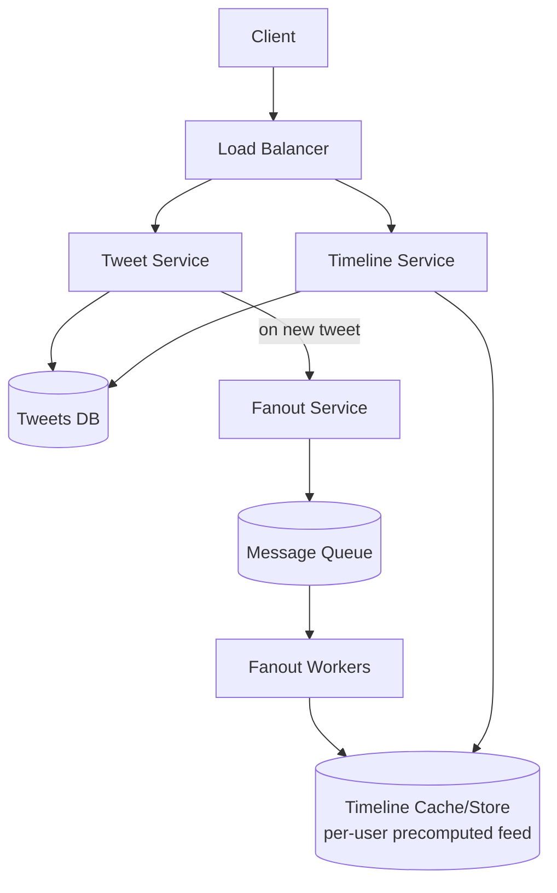
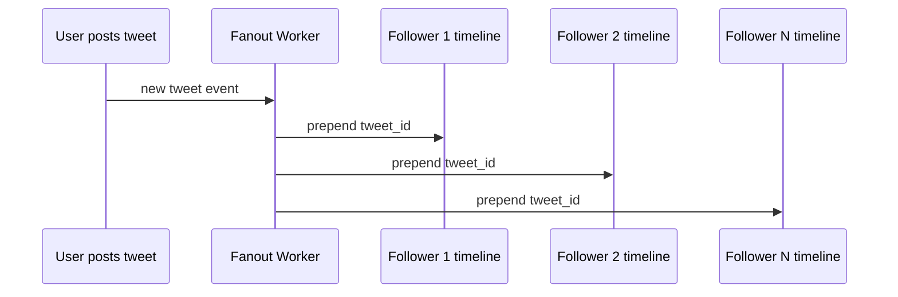
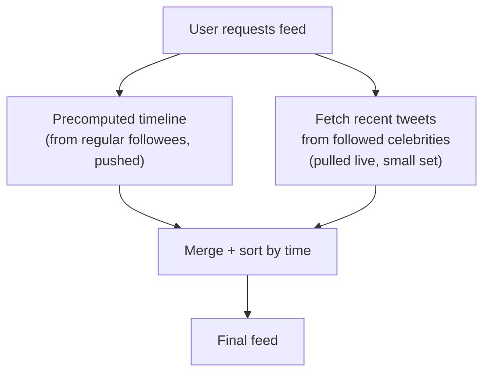

# Design Twitter (News Feed System)

## 1. Requirements
**Functional**
- Post a tweet (text + optional media)
- Follow/unfollow users
- View a home timeline: reverse-chronological tweets from people you
  follow
- (Mention, out of full scope): likes, retweets, search, trending topics

**Non-functional**
- Massive read:write skew — reads (viewing feeds) vastly outnumber
  writes (posting)
- Feed generation must be low-latency (this is the app's core loop)
- Eventual consistency acceptable (a tweet appearing a few seconds late
  in a follower's feed is fine)

## 2. Estimation
- Assume 300M DAU, 1M average tweets/sec at peak is too high — use
  realistic figures: ~200M tweets/day → ~2,300 tweets/sec average, say
  ~7,000/sec peak (writes)
- Each user checks their feed ~5x/day → 1.5B feed reads/day → ~17,000
  reads/sec average, ~50,000/sec peak
- **Read:write ratio ≈ 7:1 to 20:1** — this ratio is the single most
  important number driving the design below.
- Average follower count varies wildly: median user has ~100 followers,
  but celebrities have 100M+ — this **power-law distribution** is the
  other critical fact shaping the design.

## 3. API
```
POST /tweets            { userId, text, mediaUrls }
GET  /timeline?userId=123&cursor=...
POST /follow            { followerId, followeeId }
```

## 4. Data model
```
tweets        tweet_id (PK), user_id, text, media_urls, created_at
follows       follower_id, followee_id  (composite key, indexed both ways)
timelines     user_id (PK), [tweet_id, ...] -- precomputed feed (see below)
```
Wide-column store (Cassandra) or a KV store fits `timelines` well
(simple key → ordered list of IDs, high write volume, no complex
queries needed). `tweets` and `follows` can be relational or wide-column
depending on query needs.

## 5. High-level design


## 6. Deep dive: fan-out-on-write vs fan-out-on-read
This is the **core design decision** of any feed system.

### Fan-out-on-write (push model)
When a user tweets, immediately push the tweet ID into the precomputed
timeline of **every follower**.

- **Pros**: reading a feed is just `GET timelines[user_id]` — O(1),
  extremely fast, since work was done at write time.
- **Cons**: a user with 100M followers triggers 100M writes for a
  single tweet ("celebrity problem") — hugely expensive and slow, and
  wasteful if many of those followers never even check their feed.

### Fan-out-on-read (pull model)
Feed is computed **at read time**: fetch recent tweets from everyone the
user follows, merge, sort, return.
- **Pros**: no wasted work for inactive followers; posting a tweet is
  cheap regardless of follower count.
- **Cons**: reading a feed becomes expensive (fan-in from potentially
  thousands of followees, merge-sort at request time) — the read path
  is now on the critical, high-volume side of the read:write ratio,
  which is exactly the wrong place to put expensive work.

### Hybrid approach (what Twitter actually does)
- **Regular users** (most of the userbase): fan-out-on-write — their
  tweets get pushed to followers' precomputed timelines immediately,
  since follower counts are small.
- **Celebrities** (users above a follower-count threshold): **skip**
  fan-out-on-write for their tweets. Instead, at read time, merge the
  requesting user's precomputed timeline with a separate, small,
  live-fetched set of recent tweets from any celebrities they follow.


This bounds the worst-case fan-out cost (celebrities never trigger
mass writes) while keeping the common case (99%+ of users) fast to
read.

## 7. Deep dive: timeline storage & caching
- Precomputed timelines store just **tweet IDs** (not full tweet
  content) per user, capped at a reasonable length (e.g., last 800
  tweet IDs) — old entries beyond that are dropped, since nobody scrolls
  that deep in practice.
- Actual tweet **content** is fetched from a separate cache
  (tweet_id → tweet content), so popular tweets' content is cached once
  and reused across every follower's feed, instead of being duplicated
  per-follower.
- New users / cold-start (no precomputed timeline yet): fall back to
  fan-out-on-read for their very first feed load, then start
  maintaining their precomputed timeline going forward.

## 8. Bottlenecks & scaling
- **Fanout queue backpressure**: during a fanout burst (a moderately
  popular user with 500K followers tweets), the fanout workers must
  process asynchronously via a queue rather than synchronously in the
  tweet-posting request path — a user shouldn't wait for fanout to
  complete before their "tweet posted" confirmation returns.
- **Timeline storage sharding**: shard the `timelines` store by
  `user_id` (each user's feed lives on one shard) — this access pattern
  never needs cross-shard joins.
- **Hot tweet caching**: a viral tweet is read by millions of feeds
  simultaneously — cache its content aggressively (see
  [caching](../02-building-blocks/caching.md)) since it's an extreme
  "hot key."

## Related
- [Message queues](../02-building-blocks/message-queues.md)
- [Caching](../02-building-blocks/caching.md)
- [CQRS & Event Sourcing](../03-architecture-patterns/cqrs-event-sourcing.md)
- [Instagram case study](design-instagram.md) (similar feed problem)