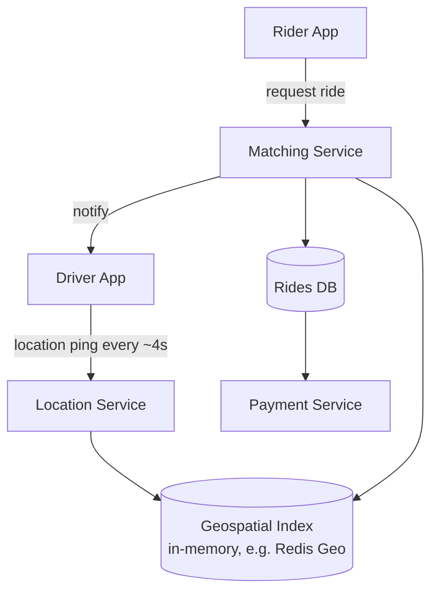
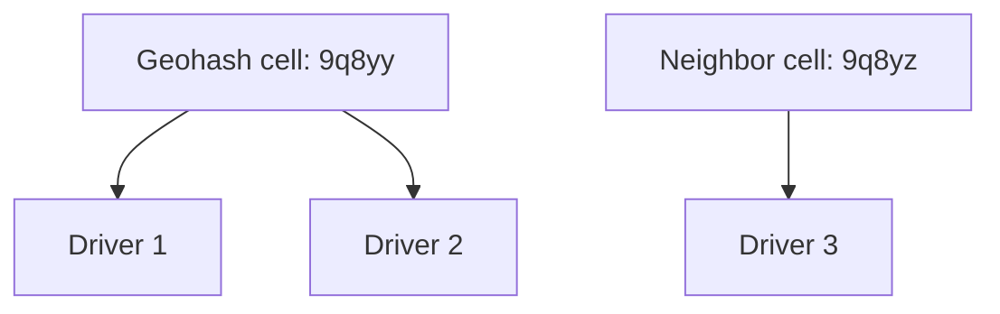
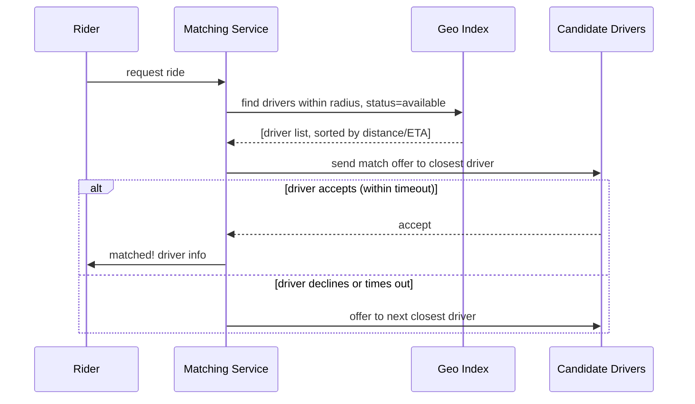

# Design Uber (Ride-Hailing System)

## 1. Requirements
**Functional**
- Rider requests a ride; system matches them with a nearby available
  driver
- Real-time location tracking of driver during the trip
- Fare calculation, trip lifecycle (requested → matched → in-progress →
  completed → paid)

**Non-functional**
- Very low-latency matching (users won't wait long for a match)
- Handle continuous, high-volume location updates from all active
  drivers
- Strong consistency needed for critical steps (a driver can't be
  matched to two riders simultaneously)
- Geographic locality — most operations are inherently regional

## 2. Estimation
- Assume 5M daily active drivers, each sending a location ping every 4
  seconds while active/online → ~5M / 4 ≈ **1.25M location updates/sec**
  system-wide at peak — this is the dominant write load and shapes the
  whole design.
- Assume 10M ride requests/day → modest compared to location update
  volume, but latency-critical.

## 3. API
```
POST /rides/request        { riderId, pickupLocation, destination }
POST /drivers/{id}/location { lat, lng, timestamp }
POST /drivers/{id}/status   { status: online|offline|on-trip }
GET  /rides/{id}/status
```

## 4. Data model
```
drivers        driver_id (PK), current_location (geohash), status
rides          ride_id (PK), rider_id, driver_id, pickup, destination,
               status, fare, created_at
location_pings driver_id, lat, lng, timestamp   -- high-volume, often
                                                    kept only briefly /
                                                    in-memory, not
                                                    permanently stored
                                                    at full resolution
```

## 5. High-level design


## 6. Deep dive: geospatial indexing ("find nearby drivers")
The core hard problem: given a rider's location, find available drivers
within, say, 3km, out of millions of moving drivers — fast.

### Option A — Geohashing
Encode `(lat, lng)` into a string where nearby locations share common
prefixes (e.g., `9q8yy` and `9q8yz` are close together). Store
`geohash → [driver_ids]` in an index; searching nearby drivers means
querying the target geohash cell plus its 8 neighbors (to handle
riders near a cell boundary).

- **Pros**: simple, works with standard KV stores, easy to shard by
  geohash prefix (naturally geographic sharding).
- **Cons**: fixed grid cells mean uneven driver density per cell (dense
  city center vs sparse suburbs); edge effects need the neighbor-cell
  lookup workaround.

### Option B — Quadtree
Recursively subdivide space into 4 quadrants, subdividing further only
where driver density is high. Naturally adapts to uneven density
(dense areas get finer subdivision, sparse areas stay coarse).
- **Pros**: better adapts to real-world uneven distribution than a
  fixed geohash grid.
- **Cons**: more complex to implement/maintain/shard than geohashing;
  rebalancing as drivers move requires more bookkeeping.

### Recommended approach
Use an in-memory geospatial index (**Redis with geospatial commands**,
which internally uses geohashing) for the hot "find nearby available
drivers" query, since it needs sub-second latency on a constantly
changing dataset (driver locations update every few seconds).

## 7. Deep dive: the matching algorithm

- Expanding search radius progressively if no drivers found nearby
  (concentric ring search).
- A short **accept timeout** per driver (e.g., 10–15 sec) before moving
  to the next candidate, to avoid riders waiting indefinitely on one
  unresponsive driver.
- **Avoiding double-matching**: once an offer is sent to a driver, that
  driver must be atomically locked out of receiving other offers until
  they accept/decline/timeout — implement via an atomic
  compare-and-swap on the driver's status field (e.g., Redis `SETNX` or
  a conditional DB update), since a driver being offered two rides
  simultaneously is a correctness bug, not just a UX annoyance.

## 8. Deep dive: real-time location tracking during a trip
Once matched, both rider and driver apps need a live location feed of
the driver — this is the same problem as [chat system real-time
delivery](design-chat-system.md): a WebSocket (or frequent polling as a
simpler fallback) pushes location updates to the rider's app for the
trip's duration, scoped to just that one active trip (a much smaller
fan-out than global presence).

## 9. Deep dive: consistency requirements
Unlike a social feed, several operations here **need strong
consistency**:
- Assigning a driver to a ride — must be atomic/exclusive (no
  double-booking a driver).
- Payment processing — must be transactional/idempotent.
Other data (e.g., a driver's live location shown on the map, ETA
estimates) can be eventually consistent — a location update arriving 1
second late is a non-issue.

## 10. Bottlenecks & scaling
- **Location update volume** (1M+/sec) — write to an in-memory
  geospatial store, not a traditional relational DB; older/historical
  location pings (for analytics/replay) can be batched off to a
  separate cheaper store asynchronously rather than kept in the hot
  path store.
- **Regional sharding**: the whole system shards naturally by
  geographic region (a driver in Tokyo is never matched with a rider in
  NYC) — route requests to the region-specific cluster early
  (typically at the API gateway / load balancer level) to keep matching
  logic scoped to a manageable, local dataset.
- **Surge pricing** (mention briefly): computed from the live
  supply/demand ratio in a region — an eventually-consistent, frequently
  recomputed aggregate, not something requiring strong consistency.

## Related
- [Real-time communication](../02-building-blocks/realtime-communication.md)
- [Consistent hashing](../02-building-blocks/consistent-hashing.md) (regional sharding)
- [Saga pattern](../03-architecture-patterns/saga-pattern.md) (multi-step trip/payment flow)