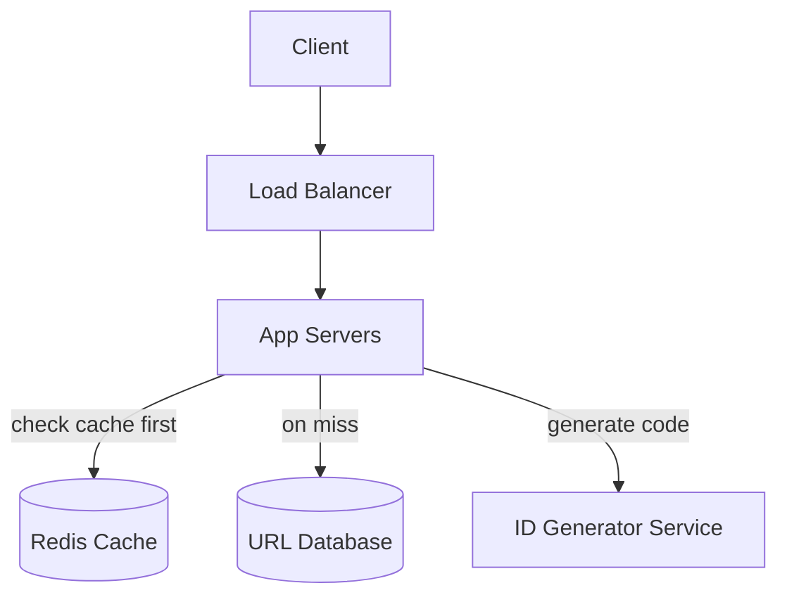
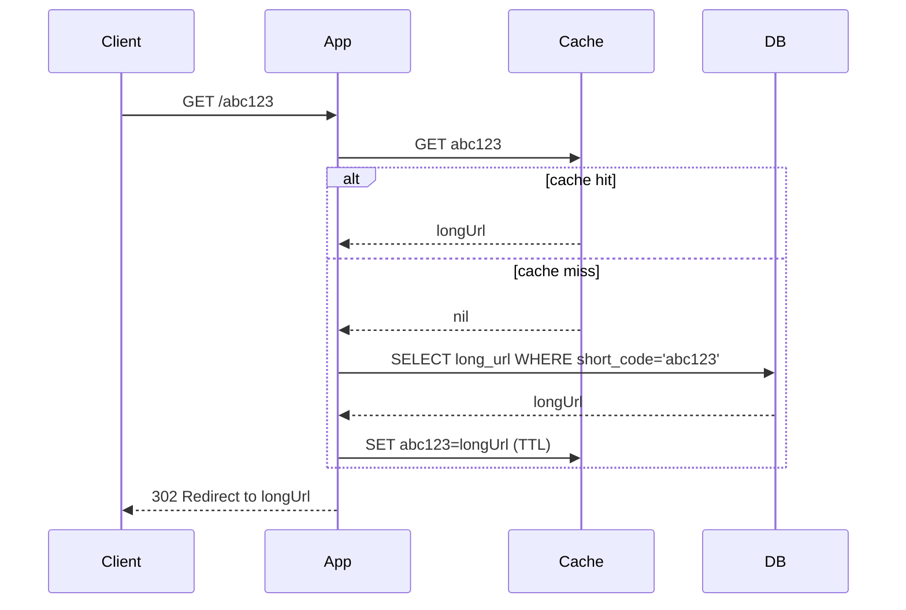

# Design a URL Shortener (TinyURL / bit.ly)

## 1. Requirements

**Functional**
- Given a long URL, generate a short URL (e.g., `short.ly/abc123`)
- Visiting the short URL redirects to the original long URL
- (Optional) custom aliases, expiration dates, click analytics

**Non-functional**
- Read-heavy: redirects (reads) vastly outnumber shortens (writes) —
  assume 100:1
- Low-latency redirects (this is on the hot path of every click)
- Short URLs should be unguessable-ish but don't need cryptographic
  security
- High availability (a broken redirect service breaks links everywhere
  they were shared)

**Out of scope**: user accounts/auth, link management UI (mention
briefly, don't design in depth)

## 2. Estimation
- Assume 100M new URLs shortened per month, 100:1 read:write ratio →
  10B redirects/month
- Writes/sec ≈ 100M / 2.6M sec ≈ **~40 writes/sec** (trivial)
- Reads/sec ≈ 10B / 2.6M sec ≈ **~3,800 reads/sec** average, say
  **~12,000 RPS** at peak
- Storage: 100M new rows/month × ~500 bytes/row (URL + metadata) ≈ 50GB/
  month → over 5 years, ~3TB (very manageable)

## 3. API
```
POST /api/shorten
  body: { longUrl, customAlias?, expiresAt? }
  response: { shortUrl }

GET /{shortCode}
  → 301/302 redirect to the long URL
```

## 4. Data model
```
urls
  short_code   VARCHAR(8)  PRIMARY KEY
  long_url     TEXT
  created_at   TIMESTAMP
  expires_at   TIMESTAMP NULL
  click_count  BIGINT DEFAULT 0   -- optional, or track in a separate analytics store
```
A simple key-value shape — this maps naturally to either a relational
table or a key-value store (DynamoDB/Redis-backed).

## 5. High-level design


## 6. Deep dive: generating the short code
### Option A — Hash-based
`base62(md5(longUrl))`, truncate to 7 characters.
- **Problem**: collisions (two different URLs producing the same
  truncated hash) — need a collision-check-and-retry loop against the
  DB, adding latency and complexity on writes.

### Option B — Counter + Base62 encoding (recommended)
Maintain a globally unique, monotonically increasing counter (e.g., via
a dedicated ID-generation service, or pre-allocated ID ranges handed out
to app servers to avoid a synchronous call on every write — see the
"range handout" idea below). Encode the counter in **Base62**
(`[a-zA-Z0-9]`) to get a compact, collision-free short code.

```
counter = 125_000_000
base62(counter) = "8M0kX"
```
- **7 characters of Base62** → 62^7 ≈ 3.5 trillion unique codes — more
  than enough.
- **No collisions possible** (each counter value used exactly once).
- **ID generation at scale**: a single centralized counter is a
  bottleneck/SPOF. Standard fix: a lightweight ID service (e.g., backed
  by Zookeeper/etcd or a DB row with `SELECT ... FOR UPDATE`) hands out
  **ranges** of IDs to each app server (e.g., "you own 1,000,000–
  1,000,999") — each server then assigns from its local range without a
  network call per request, refilling its range when exhausted. This is
  the same idea as Twitter's Snowflake / Instagram's ID generation
  approach.

### Option C — Random string + collision check
Generate a random 7-char Base62 string, check if it exists, retry on
collision. Simple, but at high write volume the collision probability
(and retry cost) increases as the keyspace fills up — Option B avoids
this entirely.

## 7. Deep dive: the redirect path (the hot path)

- Cache the mapping aggressively (short codes are immutable once
  created — perfect cache candidates, long TTL or no TTL with explicit
  invalidation only on delete).
- **301 vs 302**: 302 (temporary redirect) lets you keep tracking clicks
  and change the destination later; 301 (permanent) gets cached by
  browsers/CDNs, reducing load on your service further but sacrificing
  click analytics and flexibility. Most URL shorteners use 302 for this
  reason.
- A CDN in front of the redirect endpoint can serve extremely popular
  links without hitting your origin at all.

## 8. Bottlenecks & scaling
- **Database**: with counter-based IDs, sharding is simple — shard by
  `short_code` range or hash, since there are no cross-entity joins
  needed for a lookup-by-key access pattern.
- **Hot links**: a viral link gets massively more traffic than average
  — the cache layer (plus optional per-node local cache for the hottest
  keys) absorbs this; consider a CDN for the redirect itself.
- **Analytics**: if click tracking is required, don't write it
  synchronously on the hot path — publish a `LinkClicked` event to a
  queue and process analytics asynchronously (see [message
  queues](../02-building-blocks/message-queues.md)).

## Related
- [Consistent hashing](../02-building-blocks/consistent-hashing.md)
- [Caching](../02-building-blocks/caching.md)
- [Pastebin case study](design-pastebin.md) (very similar shape)