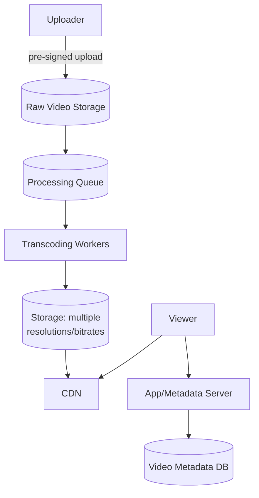
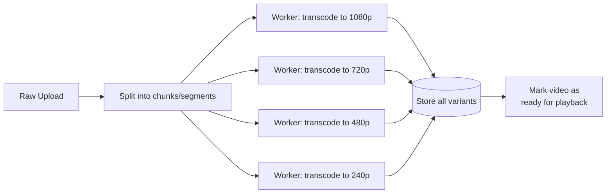
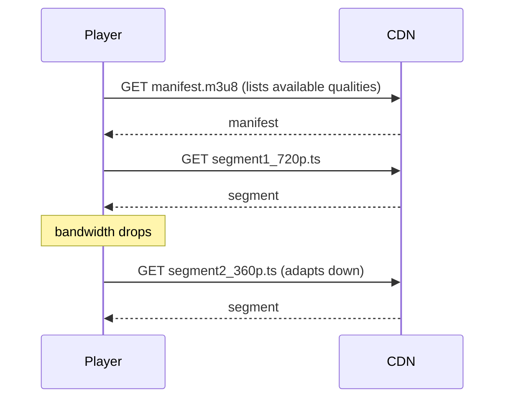

# Design a Video Streaming Platform (YouTube / Netflix)

## 1. Requirements
**Functional**
- Upload a video; it becomes available for streaming
- Stream video to users at a quality appropriate to their bandwidth
- (YouTube-specific) search, recommendations, comments — mention
  briefly, not the focus
- (Netflix-specific) licensing/catalog — out of scope, focus on the
  streaming pipeline which is the interesting systems problem either way

**Non-functional**
- Massive storage (video is the largest data type any of these case
  studies deal with)
- Global low-latency playback start ("time to first frame")
- Playback must adapt to fluctuating network conditions without
  buffering/stalling
- Very read-heavy (views vastly outnumber uploads)

## 2. Estimation
- Assume 500 hours of video uploaded per minute (a real YouTube-scale
  figure) → ~720,000 hours/day
- At ~1GB/hour for a reasonably compressed source format, that's
  **~720TB of new raw video per day** before even accounting for
  multiple output resolutions — this number alone tells you object
  storage + CDN is non-negotiable, and processing must be async/batched.
- Multiply storage further by ~5-6x to account for storing multiple
  resolution/bitrate variants of each video (see transcoding below).

## 3. High-level design

## 4. Deep dive: upload path
Same pre-signed-URL pattern as [Instagram's upload
path](design-instagram.md#6-deep-dive-media-upload-path) — the client
uploads the raw video file directly to object storage, bypassing app
servers, ideally via **chunked/multipart upload** so large files upload
in parallel and can resume after a network interruption without
restarting from zero.

## 5. Deep dive: transcoding pipeline
Raw uploaded video must be converted into multiple resolutions and
bitrates so playback can adapt to each viewer's device/bandwidth.

- Transcoding is CPU-intensive and slow (minutes for a long video) —
  must run **asynchronously** via a worker pool pulling from a queue,
  never synchronously in the upload request.
- Splitting a video into independent chunks lets multiple workers
  transcode different segments of the *same* video in parallel,
  reducing end-to-end processing latency for long videos.
- A video is only marked "ready to view" once at least the lowest
  required resolution variant is done — higher resolutions can finish
  slightly later without blocking initial availability.

## 6. Deep dive: adaptive bitrate streaming (the key technique)
Video isn't sent as one giant file — it's split into short segments
(typically 2–10 seconds each), available at multiple quality levels. The
player downloads a manifest describing available qualities/segments and
picks the best one **per segment**, based on currently observed
bandwidth — switching quality up or down seamlessly as conditions
change, rather than committing to one fixed quality for the whole video.

Standard protocols implementing this: **HLS** (HTTP Live Streaming,
Apple-originated, `.m3u8` manifests) and **MPEG-DASH** (open standard,
`.mpd` manifests) — both are just HTTP, so they cache/CDN naturally
without any special streaming server protocol.

## 7. Deep dive: delivery via CDN
- All video segments are served from CDN edge locations, not the
  origin — a video watched by millions should almost never hit origin
  storage after the first view in a region warms the cache (see
  [CDN](../02-building-blocks/cdn.md)).
- **Popularity-aware caching**: extremely popular content might be
  pre-pushed to edge locations proactively; long-tail content relies on
  pull-based caching on first request per region.

## 8. Deep dive: metadata & recommendations (brief)
Video metadata (title, description, view count, uploader) lives in a
standard database, decoupled entirely from the video bytes themselves.
View counts, like Instagram's like counts, should be aggregated
asynchronously (batched counter updates) rather than a synchronous
increment on every single view, given the write volume of a popular
video.

## 9. Bottlenecks & scaling
- **Transcoding throughput**: horizontally scale the worker pool; use
  spot/preemptible compute where possible since transcoding is
  batchable and tolerant of worker interruption/retry.
- **Storage cost**: multiple resolution variants multiply storage
  several-fold — apply lifecycle policies (cold storage for rarely
  watched long-tail content, especially older/unpopular uploads).
- **"Time to first frame"**: minimize by fetching the lowest-quality
  first segment immediately, then adapting upward — prioritizing
  perceived start speed over immediately playing at the ideal quality.

## Related
- [CDN](../02-building-blocks/cdn.md)
- [Object storage](../02-building-blocks/object-storage.md)
- [Message queues](../02-building-blocks/message-queues.md) (async transcoding pipeline)
- [Instagram case study](design-instagram.md) (shared upload pattern)