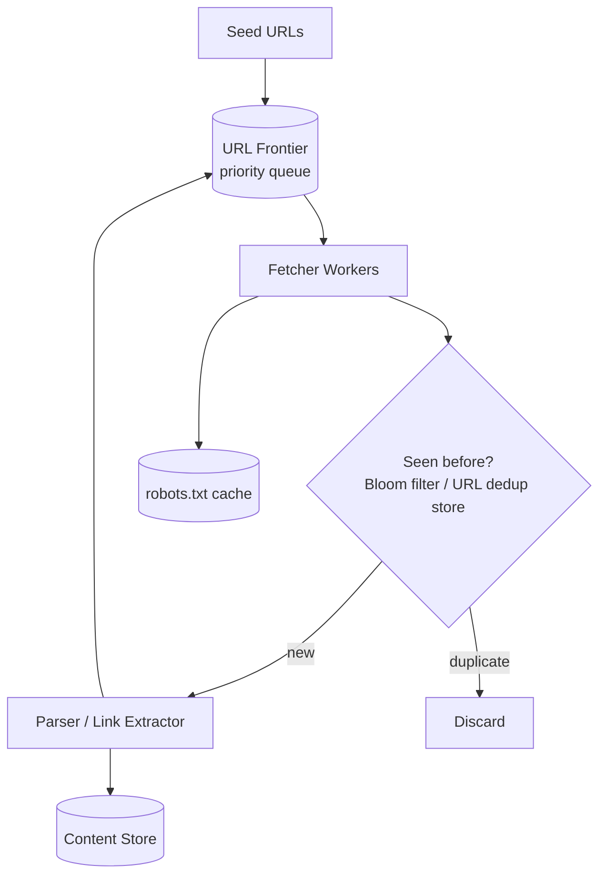
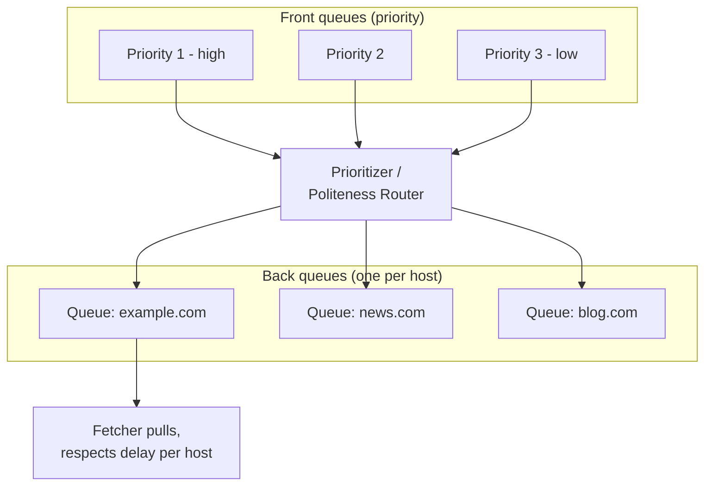
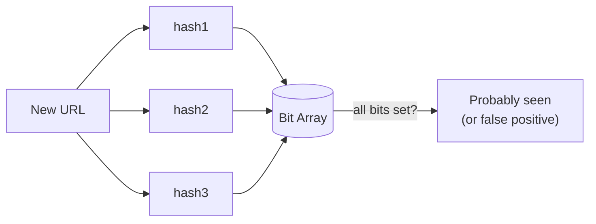

# Design a Web Crawler

## 1. Requirements
**Functional**
- Given seed URLs, discover and download web pages, extract links, and
  crawl those too
- Store/index crawled content for downstream use (search, analysis)
- Respect `robots.txt` and avoid overloading any single site

**Non-functional**
- Scalable to billions of pages
- Polite (rate-limited per domain — don't hammer any single site)
- Avoid re-crawling the same URL infinitely (cycle detection);
  periodically re-crawl for freshness
- Extensible (handle different content types, avoid crawler traps)

## 2. Estimation
- Target: crawl 1 billion pages/month
- Pages/sec ≈ 1B / 2.6M ≈ **~400 pages/sec** average, higher at peak
- Assume avg page size 100KB → 1B × 100KB = **100TB/month** of raw
  content to store

## 3. High-level design

## 4. Deep dive: the URL frontier (the core data structure)
The frontier is a priority queue of URLs to crawl next — but naive FIFO
isn't enough because of **politeness** (don't hit the same domain too
often) and **priority** (some pages should be crawled/recrawled more
often — e.g., a news homepage vs a static archive page).

Standard design (as in the classic Mercator crawler architecture):

- **Front queues** implement prioritization (pick a URL from a
  higher-priority front queue more often).
- **Back queues**, one per host, implement **politeness** — a fetcher
  only pulls from a host's back queue after waiting the required delay
  since its last request to that host, guaranteeing no single domain
  gets hammered regardless of overall crawl parallelism.

## 5. Deep dive: avoiding duplicate crawls
At billions of URLs, an exact-match "have we seen this URL" set would
be enormous. Use a **Bloom filter**: a space-efficient probabilistic
set structure — false positives possible (rarely, incorrectly says "yes,
seen it" when not), false negatives impossible (never wrongly says
"never seen" for something actually seen) — a very good trade for this
use case, since occasionally missing a re-crawl opportunity is harmless,
but massive memory savings versus an exact hash set are valuable at
this scale.

## 6. Deep dive: politeness & robots.txt
- Fetch and cache each domain's `robots.txt` before crawling it;
  respect `Disallow` rules and any specified `Crawl-delay`.
- Enforce a minimum delay between requests to the same host (even
  beyond what robots.txt specifies) as a good-citizen default.
- Distribute fetcher load so requests to any one domain are naturally
  rate-limited regardless of how many total fetcher workers exist (the
  per-host back-queue design above achieves this even under massive
  overall parallelism).

## 7. Deep dive: avoiding crawler traps
Some sites generate infinite URLs dynamically (e.g., a calendar page
with an infinite "next month" link, or session-ID query parameters
creating unique URLs endlessly). Mitigations:
- Cap crawl depth per domain, or total pages per domain per time period.
- Normalize URLs (strip session IDs/tracking params, sort query params)
  before dedup-checking, so semantically-identical URLs collapse to one.
- Detect and flag domains with abnormally high unique-URL growth rates
  for manual review / reduced crawl priority.

## 8. Deep dive: content storage & freshness
- Store crawled content in **object storage**, with a metadata DB
  tracking URL → last-crawled-time, content hash (to detect if a page
  actually changed since last crawl), and crawl priority/frequency.
- **Freshness**: recrawl frequency should adapt — high for
  frequently-changing pages (news), low for static ones (historical
  archives) — track a per-URL "change frequency" estimate from
  observed history and use it to schedule recrawls.
- **Content hashing**: skip reprocessing/reindexing downstream if a
  recrawled page's content hash matches the previous crawl (unchanged)
  — avoids wasted work on stable pages recrawled just for freshness
  verification.

## 9. Bottlenecks & scaling
- **Fetcher parallelism vs politeness**: total system throughput is
  bounded not by fetcher count but by (number of distinct domains ×
  their individual rate limits) — crawling breadth (many domains) scales
  throughput much better than crawling one domain harder.
- **DNS resolution** at this scale needs its own caching layer (DNS
  lookups are surprisingly expensive in aggregate at billions of
  requests).
- **Distributed frontier**: at extreme scale, the frontier itself is
  sharded (e.g., by host hash) across multiple queue partitions/machines
  so no single frontier node is a bottleneck.

## Related
- [Message queues](../02-building-blocks/message-queues.md)
- [Object storage](../02-building-blocks/object-storage.md)
- [Rate limiting](../02-building-blocks/rate-limiting.md) (conceptually similar to politeness)