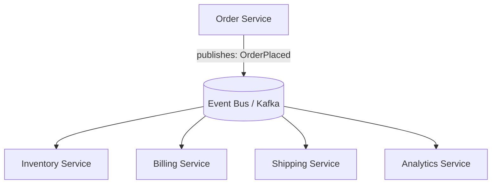
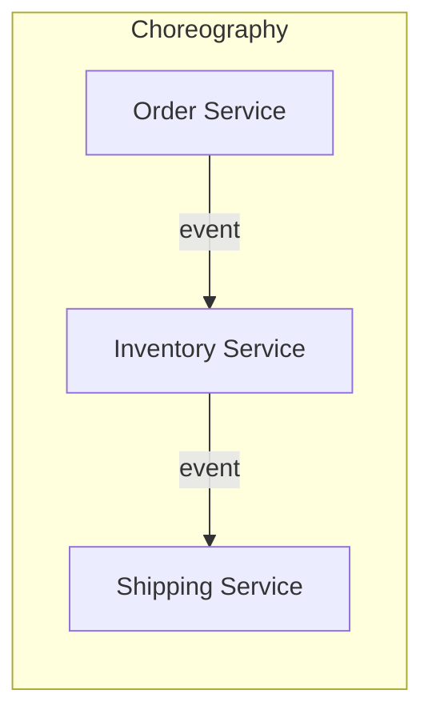
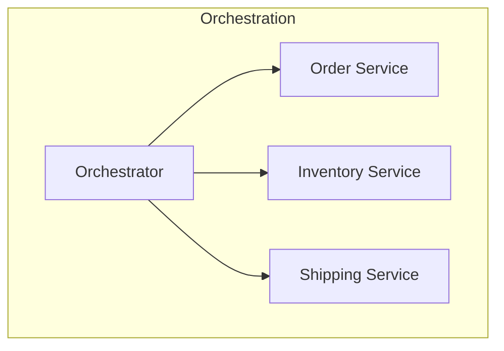

# Event-Driven Architecture

Services communicate by producing and reacting to **events** ("Order
Placed", "Payment Failed") rather than calling each other directly.
Producers don't know or care who consumes their events.

## Benefits
- **Loose coupling**: producers and consumers evolve independently;
  adding a new consumer requires zero changes to the producer.
- **Scalability**: consumers scale independently based on their own
  load.
- **Resilience**: a slow/down consumer doesn't block the producer
  (events queue up and get processed when the consumer recovers).
- **Auditability**: the event log is a natural audit trail of
  everything that happened.

## Costs
- **Eventual consistency**: consumers react asynchronously, so there's
  a window where the system is in an intermediate state.
- **Harder debugging**: a single business operation's effects are
  spread across many services/logs — needs distributed tracing
  (correlation IDs) to follow a request end-to-end.
- **Event schema evolution**: producers and consumers must agree on
  event formats over time — needs versioning discipline (e.g., Avro/
  Protobuf schemas with a schema registry).
- **Duplicate/out-of-order events**: consumers must be idempotent and
  handle re-ordering (see [message queues](../02-building-blocks/message-queues.md)).

## Choreography vs Orchestration
- **Choreography**: no central coordinator — each service reacts to
  events and emits its own events; the overall flow "emerges" from
  individual reactions. Great for loose coupling, but the end-to-end
  flow is harder to see/reason about as a whole.
- **Orchestration**: a central coordinator (orchestrator) explicitly
  calls each service in sequence and tracks the overall workflow state.
  Easier to understand/monitor/retry as a single unit, but the
  orchestrator becomes a central dependency.

## Event notification vs event-carried state transfer
- **Event notification**: event just says "something happened" (e.g.,
  `OrderPlaced { orderId: 123 }`) — consumer must call back to fetch
  full details. Smaller events, but adds a synchronous dependency back
  on the producer.
- **Event-carried state transfer**: event includes the full relevant
  data (`OrderPlaced { orderId, items, total, address, ... }`) —
  consumer is fully self-sufficient, at the cost of larger events and
  potential duplication of data across services.

## Interview tip
Use event-driven architecture explicitly for **fan-out** scenarios (one
action → multiple independent side effects) and when producer/consumer
availability shouldn't be coupled. Don't over-apply it to simple
request/response needs where a direct call is simpler and easier to
debug.

## Related
- [Message queues](../02-building-blocks/message-queues.md)
- [Saga pattern](saga-pattern.md)
- [CQRS & Event Sourcing](cqrs-event-sourcing.md)