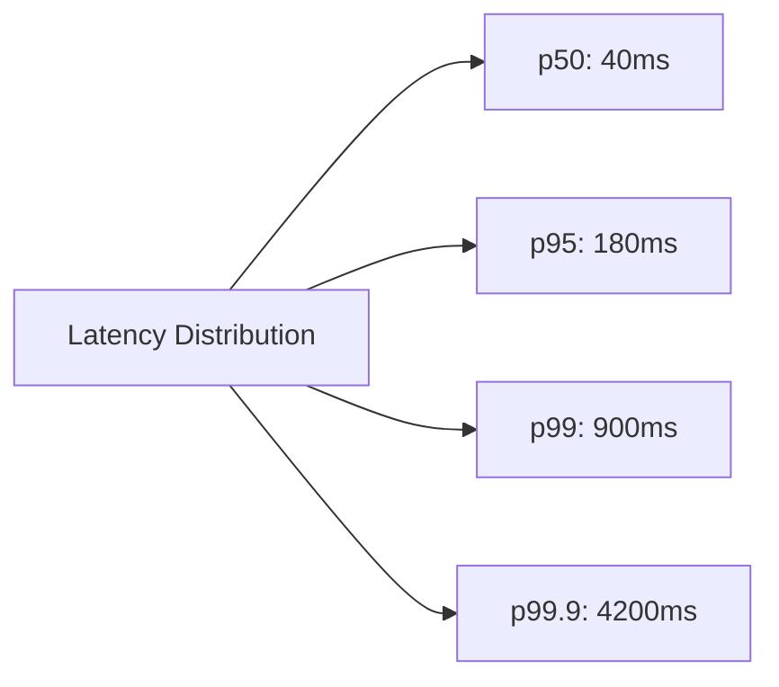

# Latency & Throughput

## Definitions
- **Latency**: time for a single operation to complete (e.g., "this API
  call takes 120ms"). Lower is better.
- **Throughput**: number of operations completed per unit time (e.g.,
  "this service handles 5,000 requests/sec"). Higher is better.

These are related but distinct — you can improve one while hurting the
other. Example: batching requests improves throughput (more work done
per network round-trip) but increases latency for any individual request
(it waits for the batch to fill).

## Percentiles matter more than averages
Never describe latency with just an average — a few slow outliers get
hidden. Use percentiles:

- **p50 (median)**: typical experience
- **p95**: 95% of requests are faster than this — where "annoying but
  rare slowness" shows up
- **p99 / p99.9**: tail latency — critical for services with many
  downstream calls, because tail latency compounds (if a page makes 20
  backend calls, the chance *at least one* hits the p99 tail is high)

## Numbers every system designer should know (approximate)
| Operation | Latency |
|---|---|
| L1 cache reference | ~1 ns |
| Main memory (RAM) reference | ~100 ns |
| SSD random read | ~100 μs (0.1 ms) |
| Round trip within same datacenter | ~0.5 ms |
| Read 1 MB sequentially from SSD | ~1 ms |
| HDD seek | ~10 ms |
| Round trip between continents (e.g., US↔Europe) | ~100–150 ms |

**Takeaway**: memory ≪ SSD ≪ disk seek ≪ network round trip. This is why
caching (avoiding disk/network) has such an outsized performance impact,
and why cross-region calls are avoided on hot paths.

## Back-of-envelope estimation — a repeatable method
1. **Traffic**: DAU × actions/user/day → requests/day → requests/sec
   (divide by 86,400; multiply peak by 2–3x for peak-hour multiplier)
2. **Storage**: data size per record × records/day × retention period
3. **Bandwidth**: requests/sec × avg payload size
4. **Memory (cache)**: working-set size × item size (for cache sizing)
5. **Servers needed**: total throughput ÷ throughput per server

### Worked example
Design for 100M DAU, each user makes 10 read requests/day.
- Total requests/day = 100M × 10 = 1B requests/day
- Requests/sec (average) = 1,000,000,000 / 86,400 ≈ **11,600 RPS**
- Peak (assume 3x average) ≈ **35,000 RPS**
- If each server handles 1,000 RPS → need ~35 servers at peak (before
  redundancy/headroom — typically add 30–50% buffer)

See [estimation-cheatsheet.md](../04-interview-approach/estimation-cheatsheet.md)
for a ready reference of common conversion numbers.

## Interview tip
Interviewers care less about the exact final number and more about
whether your math is structured and your assumptions are stated out
loud ("I'll assume average payload size is 1KB..."). Round aggressively
(estimate to the nearest power of 10) — precision isn't the point, order
of magnitude is.