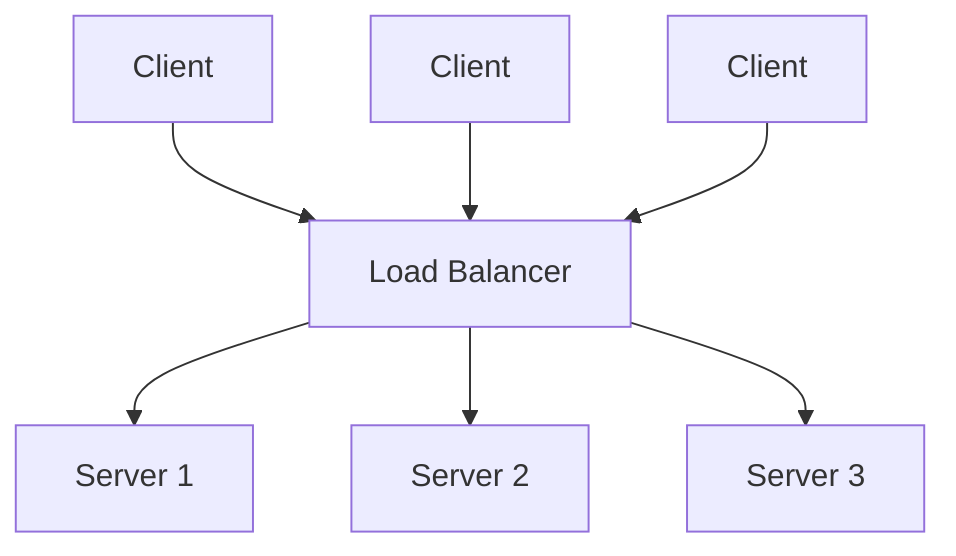
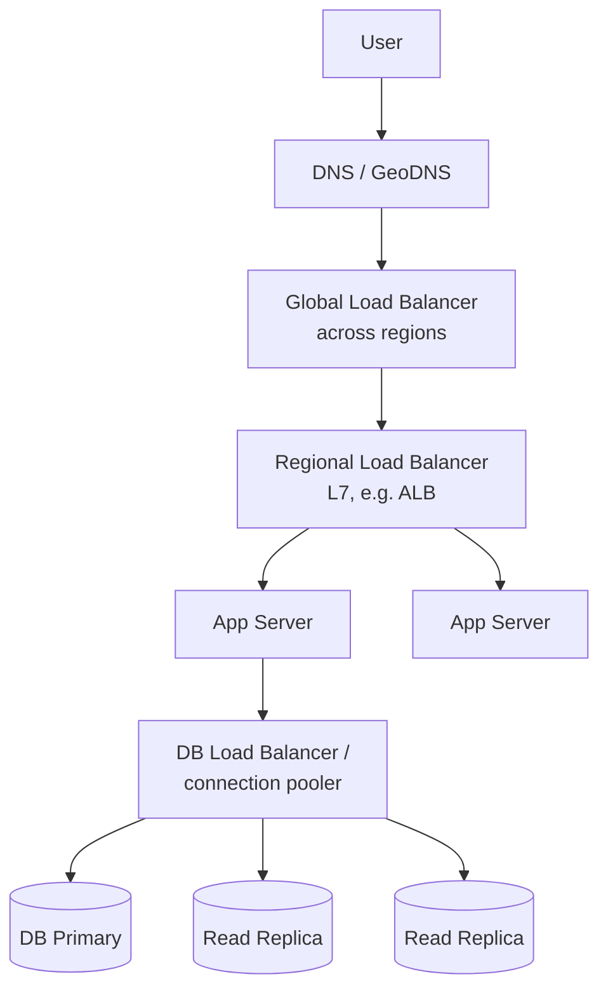

# Load Balancing

A load balancer (LB) distributes incoming traffic across multiple
servers so no single server is overwhelmed, and so failed servers can be
routed around transparently.

## Layer 4 vs Layer 7 load balancing
| | Layer 4 (Transport) | Layer 7 (Application) |
|---|---|---|
| Operates on | IP + TCP/UDP port | HTTP headers, cookies, URL path |
| Speed | Faster (less inspection) | Slower (parses request content) |
| Routing flexibility | Low — routes by connection only | High — route `/api/*` vs `/static/*` to different pools |
| Example | AWS NLB, `LVS` | AWS ALB, NGINX, HAProxy, Envoy |

## Load balancing algorithms
- **Round robin**: cycle through servers in order. Simple, assumes equal
  capacity/request cost.
- **Weighted round robin**: give bigger servers a higher share.
- **Least connections**: send to the server with fewest active
  connections — better for long-lived/variable-length requests.
- **Least response time**: combine connection count + latency.
- **IP hash / consistent hashing**: same client → same server
  (useful for session affinity / sticky sessions, or for cache-friendly
  routing). See [consistent-hashing.md](consistent-hashing.md).
- **Random with 2 choices**: pick 2 random servers, send to the less
  loaded of the two — simple and surprisingly effective at scale.

## Health checks
LB periodically pings servers (`GET /health`) and removes unhealthy ones
from rotation automatically — this is what makes the LB tier
self-healing.

## Placement in the stack

Load balancers exist at multiple layers: DNS/global (routes to nearest
region), regional (across app servers), and even in front of databases
(routing reads to replicas, writes to primary).

## Making the load balancer itself highly available
The LB can't be a single point of failure. Typical solution: run an
active-passive (or active-active) pair with a floating/virtual IP
(VRRP/keepalived), or use a managed cloud LB that's inherently
distributed (AWS ALB/NLB, GCP LB).

## Sticky sessions — a trade-off to flag
Routing the same client to the same server (via cookie or IP hash) lets
you keep session state in server memory, but breaks horizontal
scaling elasticity and complicates failover. **Preferred approach**: keep
app servers stateless, store session state in a shared store (Redis,
DB) so *any* server can serve *any* request.

## Interview tip
Say explicitly: "app servers should be stateless so the load balancer
can route any request to any instance" — this one sentence signals you
understand why horizontal scaling requires externalizing state.

## Related
- [Consistent hashing](consistent-hashing.md)
- [Proxy & reverse proxy](proxy-reverse-proxy.md)
- [Scalability](../01-fundamentals/scalability.md)