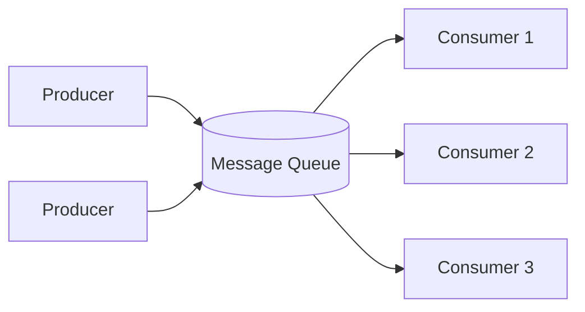

# Message Queues & Event Streaming

Asynchronous communication between services: a producer publishes a
message without waiting for the consumer to process it.

## Why use a queue?
- **Decoupling**: producer and consumer don't need to know about each
  other or be online at the same time.
- **Buffering / load leveling**: absorb traffic spikes — producers keep
  publishing even if consumers are temporarily slow, instead of the
  spike hitting downstream systems directly.
- **Reliability**: messages persist until processed; failed consumers
  can retry.
- **Scalability**: add more consumers to process the queue in parallel.

## Point-to-point (queue) vs Pub/Sub (topic)
| | Point-to-point | Pub/Sub |
|---|---|---|
| Delivery | Each message consumed by exactly **one** consumer | Each message delivered to **all** subscribers |
| Example | Task queue (process image uploads) | Event broadcast (order placed → notify inventory, billing, shipping) |
| Tools | SQS, RabbitMQ (queue) | SNS, Kafka (topic), RabbitMQ (exchange/fanout) |

## Delivery guarantees
- **At-most-once**: message might be lost, never redelivered (fire and
  forget). Fastest, least safe.
- **At-least-once**: message is guaranteed delivered, but might be
  delivered more than once (e.g., consumer crashes after processing but
  before acking) → **consumers must be idempotent**.
- **Exactly-once**: hardest to achieve in a distributed system; usually
  approximated via at-least-once delivery + idempotency keys /
  deduplication on the consumer side.

## Kafka vs traditional queues (RabbitMQ/SQS)
| | Kafka | RabbitMQ / SQS |
|---|---|---|
| Model | Distributed log (partitioned, ordered, retained) | Traditional queue (message removed after ack) |
| Message retention | Configurable, messages kept even after consumption (replay possible) | Message deleted once acked |
| Ordering | Guaranteed within a partition | Guaranteed within a queue (SQS FIFO) or not (standard SQS) |
| Throughput | Very high (built for firehose event streams) | High, but Kafka generally wins at extreme scale |
| Best for | Event sourcing, log aggregation, stream processing, replay-able event bus | Task queues, RPC-style async jobs, simple decoupling |

## Common patterns
- **Work queue**: distribute tasks (e.g., resize uploaded images) across
  a pool of workers.
- **Fanout / pub-sub**: one event triggers multiple independent
  reactions (order placed → email service, analytics, inventory).
- **Dead-letter queue (DLQ)**: messages that fail processing repeatedly
  are moved here instead of blocking the queue or being silently
  dropped — critical for debuggability.
- **Backpressure**: if consumers can't keep up, the queue grows; you
  need monitoring + autoscaling consumers, or a policy for shedding load.

## Ordering guarantees — a common gotcha
Most distributed queues **do not** guarantee global ordering across
partitions/shards, only within a single partition/queue. If a feature
needs strict ordering (e.g., "process a user's events in order"),
partition the topic **by that user's ID** so all their events land on
the same partition.

## Interview tip
Reach for a queue whenever a request-response flow has an operation that
(a) is slow, (b) doesn't need to block the user's response, or (c)
fans out to multiple downstream effects. Say explicitly what happens on
consumer failure (retry policy, DLQ, idempotency) — that's usually the
follow-up question.

## Related
- [Event-driven architecture](../03-architecture-patterns/event-driven-architecture.md)
- [Notification System case study](../05-case-studies/design-notification-system.md)