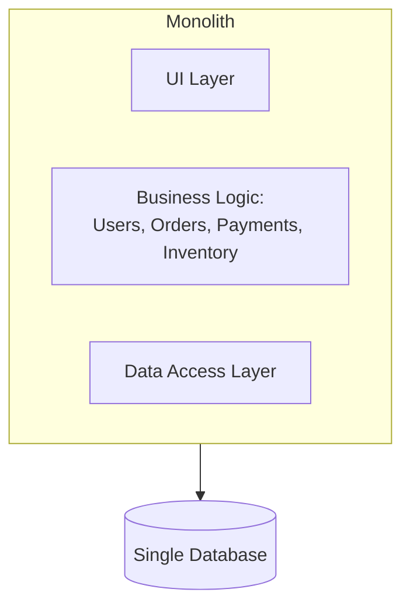
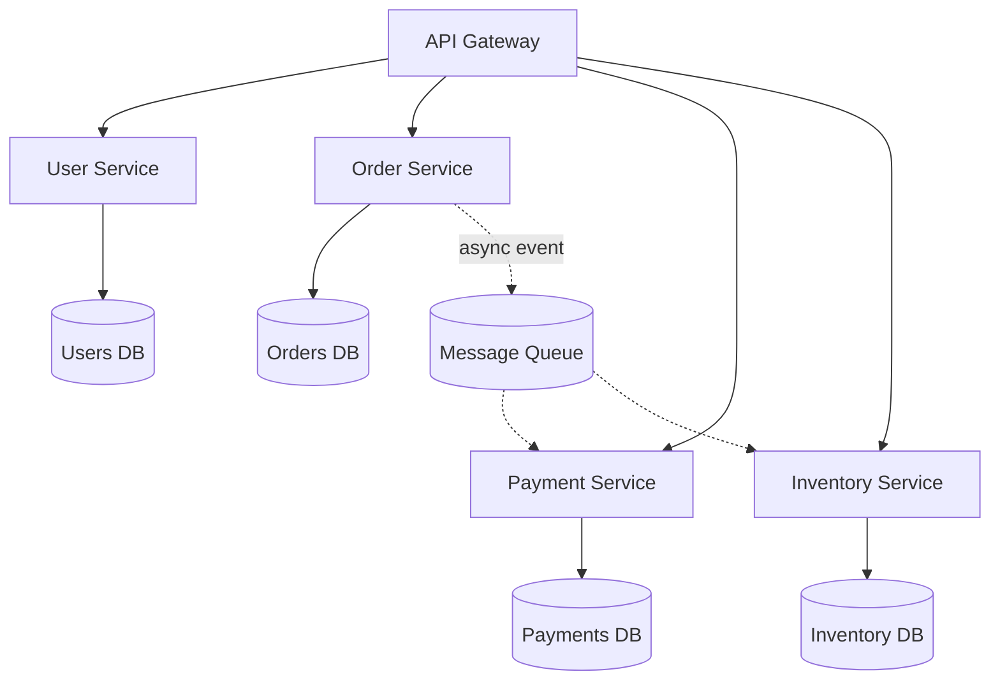

# Microservices vs Monolith

## Monolithic architecture
A single deployable unit containing all application logic.

**Pros**: simple to develop/test/deploy initially, easy transactions
(single DB, no distributed transactions), simpler debugging (one
codebase, one log stream), lower operational overhead.
**Cons**: hard to scale parts independently (must scale the whole app
even if only one module is hot), large codebase becomes harder to
reason about/onboard into, one team's bug can bring down the whole app,
slower deploys as the org grows (everyone shares one release train).

## Microservices architecture
Application split into independently deployable services, each owning
its own data store, communicating over the network.

**Pros**: independent scaling (scale only the hot service), independent
deployment (teams ship without coordinating a single release), fault
isolation (one service crashing doesn't necessarily take down others),
teams can pick different tech stacks per service.
**Cons**: distributed systems complexity (network calls can fail/be
slow — see [fallacies of distributed
computing]), no free multi-service transactions (need
[Saga pattern](../03-architecture-patterns/saga-pattern.md)), harder to
debug (need distributed tracing across services), operational overhead
(more deployables, more monitoring, service discovery), data
consistency across services is genuinely hard.

## When to choose which
| Situation | Lean toward |
|---|---|
| Early-stage startup, small team, unclear product-market fit | Monolith — optimize for iteration speed |
| Large org, many independent teams, clear service boundaries | Microservices — optimize for team autonomy & independent scaling |
| One component has very different scaling needs than the rest (e.g., video transcoding vs the rest of a web app) | Extract that one piece into its own service ("majestic monolith" + a few services) |
| Need strong cross-entity transactions constantly | Monolith (or very carefully bounded services) |

**Common wisdom**: "start with a monolith, extract microservices once
you have real scaling/team pain points and clear domain boundaries" —
premature microservices are a well-known anti-pattern (you pay all the
distributed-systems tax before you have the scale that justifies it).

## Communication between microservices
- **Synchronous**: REST/gRPC request-response — simple, but couples
  services' availability together (if B is down, A's call to B fails).
- **Asynchronous**: message queues/events — decouples availability, but
  adds eventual consistency and complexity (see [message
  queues](message-queues.md), [event-driven
  architecture](../03-architecture-patterns/event-driven-architecture.md)).

## Service discovery
In a dynamic fleet (auto-scaling, containers), services need to find
each other's current network locations. Options: DNS-based, a registry
(Consul, etcd, Eureka), or a service mesh (Istio/Linkerd) that handles
discovery + retries + mTLS transparently via sidecar proxies.

## Interview tip
If asked to design a large system, it's fine to sketch it as a set of
microservices — but justify the **boundaries** (why is "Order" its own
service and not part of "User"?) using domain-driven design thinking:
services should own a cohesive piece of business capability and its own
data.

## Related
- [Event-driven architecture](../03-architecture-patterns/event-driven-architecture.md)
- [Saga pattern](../03-architecture-patterns/saga-pattern.md)
- [Message queues](message-queues.md)