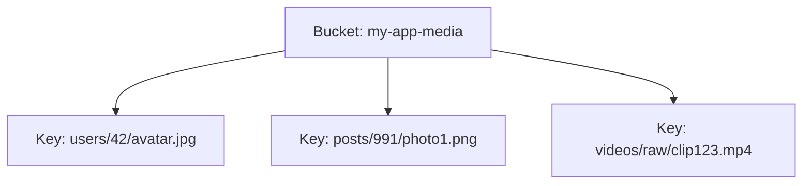
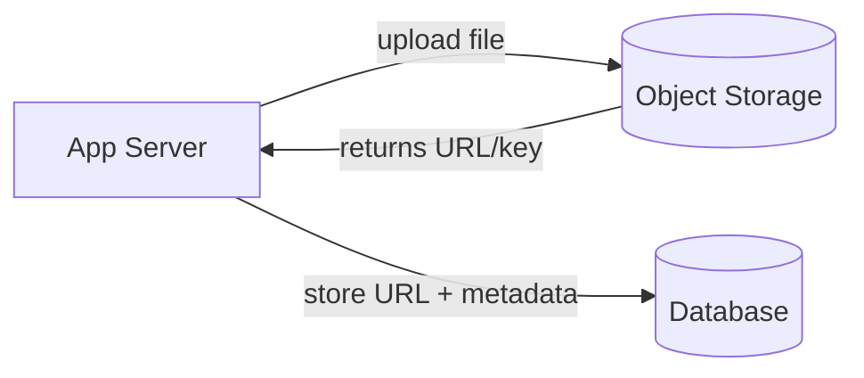
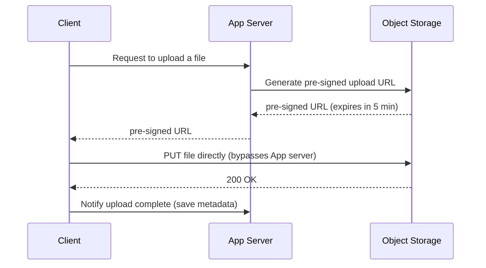

# Blob / Object Storage

Storage systems designed for large, unstructured binary data (images,
videos, backups, logs) — as opposed to structured rows in a database.

## Object storage model
Flat namespace of **buckets** containing **objects**, each identified by
a key (often looks like a file path but isn't a real hierarchical
filesystem). Every object also has metadata (content-type, custom tags).
- **Examples**: Amazon S3, Google Cloud Storage, Azure Blob Storage,
  MinIO (self-hosted, S3-compatible)

## Why not just store files/blobs in the database?
- Databases are optimized for structured, transactional, relatively
  small records — storing multi-MB/GB blobs bloats the DB, slows
  backups, and wastes expensive DB storage/IOPS on data that doesn't
  need transactional guarantees.
- **Standard pattern**: store the actual file in object storage; store
  only a **reference** (URL/key + metadata) in the database.

## Key features of object storage systems
- **Durability**: typically "11 nines" (99.999999999%) via erasure
  coding/replication across multiple facilities.
- **Virtually unlimited scale**: no need to pre-provision capacity.
- **Versioning**: keep historical versions of an object.
- **Lifecycle policies**: auto-transition old objects to cheaper "cold"
  storage tiers, or auto-delete after N days.
- **Pre-signed URLs**: generate a temporary, scoped URL that lets a
  client upload/download directly to/from the store without routing
  the bytes through your application servers (huge bandwidth/cost
  savings for large files).

## Chunking large files
For very large uploads (videos, backups), split into chunks uploaded in
parallel and reassembled server-side (multipart upload — supported
natively by S3-compatible APIs). Enables resumable uploads (retry just
the failed chunk, not the whole file).

## Interview tip
Any case study involving user-uploaded media (Instagram, YouTube,
Dropbox) should mention: object storage for the actual bytes, a
CDN in front of it for delivery, pre-signed URLs for direct
client-to-storage upload/download, and only metadata (owner, size,
content-type, storage key) living in your primary database.

## Related
- [CDN](cdn.md)
- [Dropbox case study](../05-case-studies/design-dropbox.md)
- [Instagram case study](../05-case-studies/design-instagram.md)