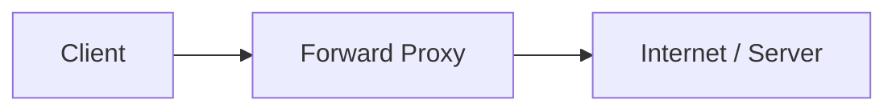
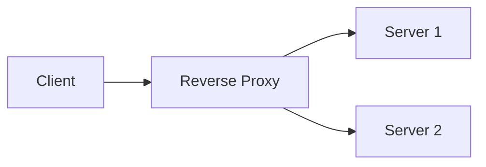
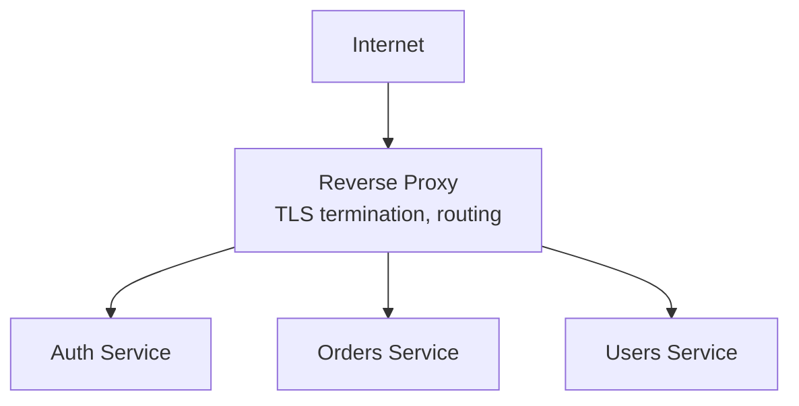
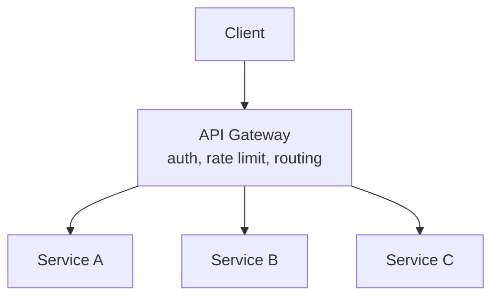

# Proxy vs Reverse Proxy

## Forward proxy
Sits in front of **clients**, forwarding their requests to the internet.
The server sees the proxy, not the actual client.

**Use cases**: corporate network content filtering, anonymizing client
identity, bypassing geo-restrictions, client-side caching.

## Reverse proxy
Sits in front of **servers**, forwarding client requests to one of
several backend servers. The client sees the proxy, not the actual
backend.

**Use cases**:
- **Load balancing** across backend instances
- **SSL/TLS termination** (decrypt HTTPS once at the proxy, backend
  servers speak plain HTTP internally — offloads crypto work)
- **Caching** responses close to the edge
- **Compression** (gzip/br) before sending to client
- **Security**: hides backend topology/IPs, can block malicious
  requests (WAF functionality), centralizes auth checks
- **Request routing**: path-based routing to different microservices
  (`/api/orders` → orders service, `/api/users` → users service)

Common reverse proxy software: **NGINX**, **HAProxy**, **Envoy**, cloud
LBs (ALB/ELB).

## Where a reverse proxy fits in the stack

## API Gateway — a specialized reverse proxy
In microservice architectures, an **API Gateway** is a reverse proxy
that additionally handles: authentication/authorization, rate limiting,
request/response transformation, API composition (aggregating calls to
multiple services into one client-facing response), and analytics —
all in one place so individual services don't each reimplement these
cross-cutting concerns.

## Interview tip
"Load balancer" and "reverse proxy" are often the same physical
component (e.g., NGINX/Envoy doing both) — it's fine to mention them
together, but be precise: load balancing is about *distributing* traffic
across replicas; a reverse proxy's role is broader (also handles
TLS, routing, security).

## Related
- [Load balancing](load-balancing.md)
- [Rate limiting](rate-limiting.md)