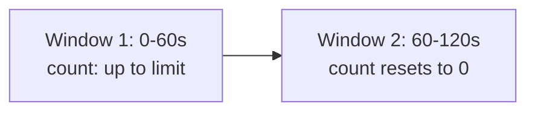
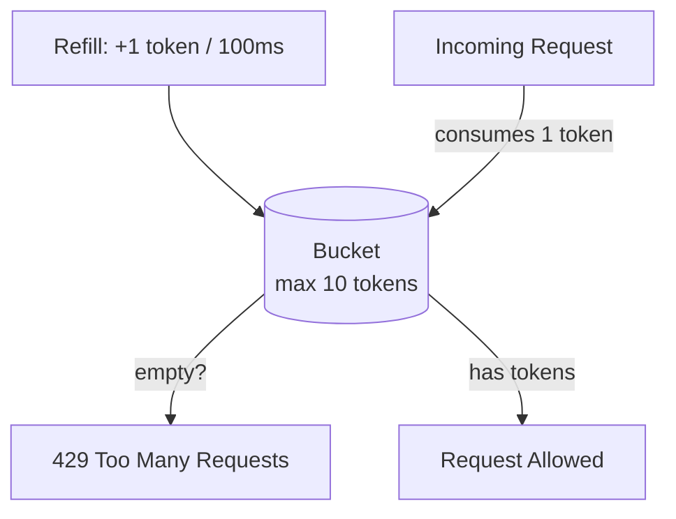

# Rate Limiting

Controls how many requests a client (user, IP, API key) can make in a
given time window — protects backend systems from overload/abuse and
enforces fair usage / pricing tiers.

## Algorithms

### Fixed window counter
Count requests in fixed time buckets (e.g., "0:00–0:01").

- **Pros**: simple, memory-efficient (one counter per window).
- **Cons**: burst at window boundary — a client can send the full limit
  at 0:59 and another full limit at 1:00, doubling the effective rate
  for a short window.

### Sliding window log
Store a timestamp for every request; count timestamps within the last
`N` seconds on each new request.
- **Pros**: precise, no boundary burst issue.
- **Cons**: memory-heavy (stores every request timestamp) — expensive at
  scale.

### Sliding window counter (hybrid)
Weighted average of the current and previous fixed windows, approximating
the sliding log with fixed-window memory efficiency.
- **Pros**: good accuracy, low memory — this is what most production
  systems (e.g., Cloudflare) actually use.

### Token bucket — most commonly used in interviews
A bucket holds tokens, refilled at a fixed rate up to a max capacity.
Each request consumes one token; if the bucket is empty, the request is
rejected/queued.

- **Pros**: allows short bursts (up to bucket size) while enforcing a
  long-term average rate; simple to reason about.
- **Cons**: needs careful tuning of bucket size vs refill rate.

### Leaky bucket
Requests enter a queue (the "bucket") and are processed ("leak out") at
a constant rate, regardless of burst. Smooths out bursts into a steady
stream (good when the downstream system needs a *constant* processing
rate, e.g., protecting a fixed-capacity worker pool), but adds latency
for bursty traffic since excess requests queue up.

## Where to enforce rate limits
- **Client-side**: cooperative only, doesn't protect against malicious
  clients — an optimization, not a defense.
- **API Gateway / reverse proxy**: centralized, protects all backend
  services uniformly.
- **Per-service**: fine-grained, protects a specific expensive endpoint.

## Distributed rate limiting
When there are multiple app server instances, counters must be shared
(otherwise each instance independently allows the full limit, N times
over). Use a centralized fast store — **Redis** with `INCR` +
`EXPIRE`, or Redis's built-in Lua scripting for atomic
check-and-increment. At very high scale, consider approximate/local
counters (each node allows limit/N, periodically synced) to avoid Redis
becoming a bottleneck itself.

## What to key on
- Per-user / API key (most common for authenticated APIs)
- Per-IP (for unauthenticated endpoints — but be aware of shared IPs
  behind NAT/corporate proxies)
- Per-endpoint (protect expensive endpoints more tightly than cheap ones)
- Combination (e.g., 100 req/min per API key AND 1000 req/min per IP as
  a secondary ceiling)

## Response contract
Return `HTTP 429 Too Many Requests` with headers:
```
X-RateLimit-Limit: 100
X-RateLimit-Remaining: 42
X-RateLimit-Reset: 1719840000
Retry-After: 30
```

## Interview tip
This is one of the most common **stand-alone** system design questions
(not just a building block) — see the full worked case study at
[design-rate-limiter.md](../05-case-studies/design-rate-limiter.md) for
scaling it across a distributed fleet.

## Related
- [Design: Rate Limiter](../05-case-studies/design-rate-limiter.md)
- [API design](api-design.md)