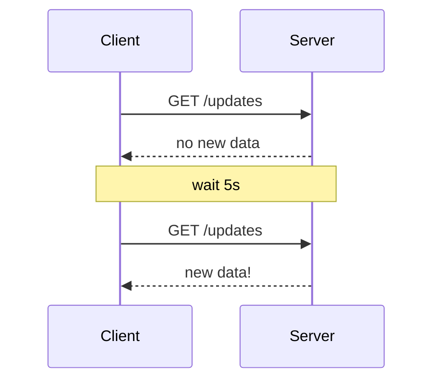
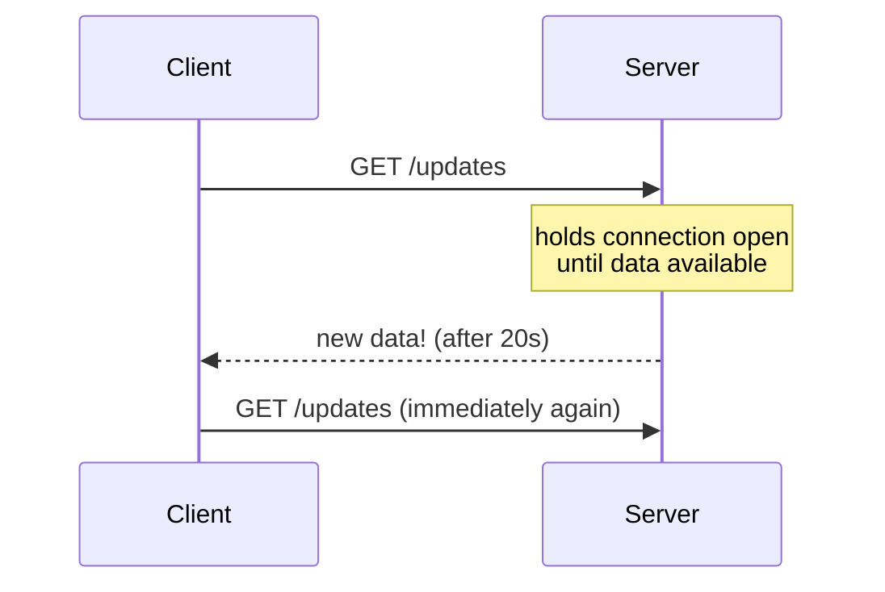
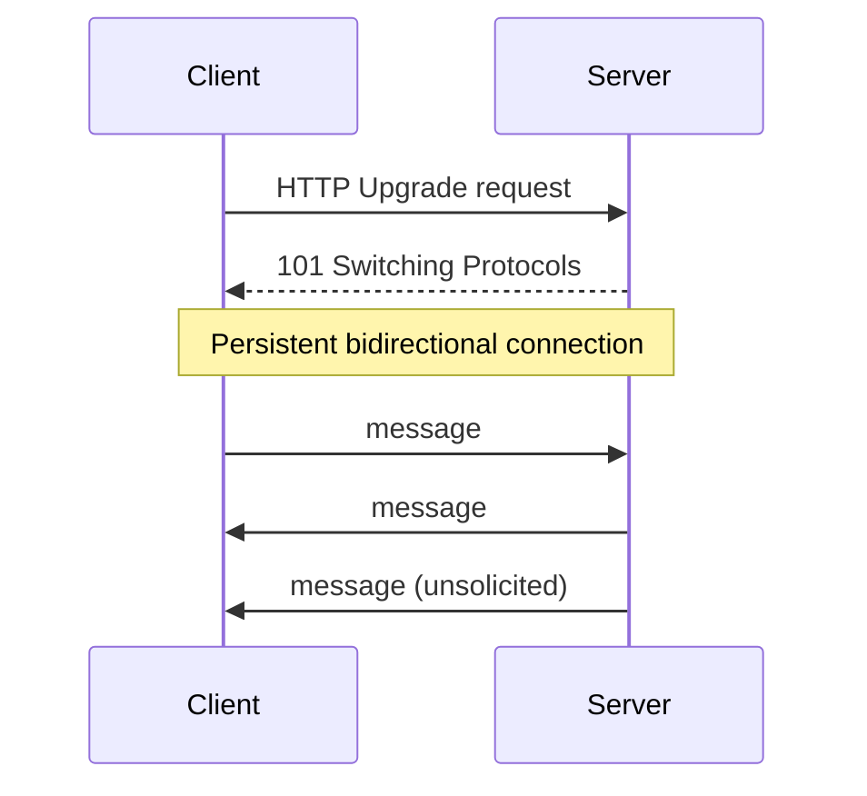
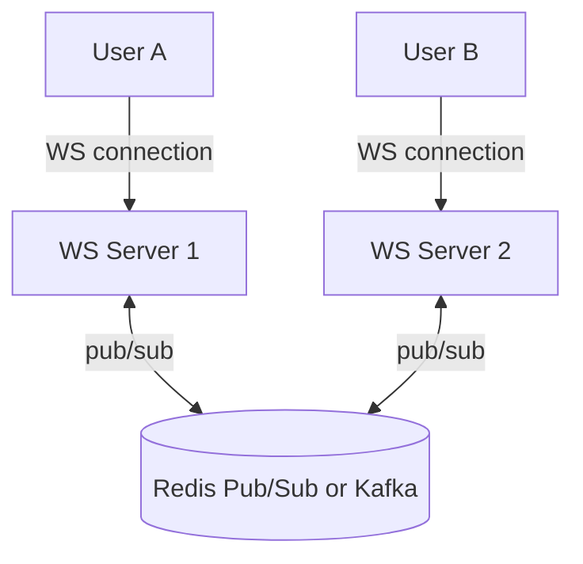

# Real-Time Communication: Polling, Long-Polling, SSE, WebSockets

## Short (regular) polling
Client asks the server "anything new?" on a fixed interval.

- **Pros**: trivial to implement, works everywhere.
- **Cons**: wasteful (many empty responses), latency bound by poll
  interval, doesn't scale well (constant request volume regardless of
  actual update frequency).

## Long polling
Client makes a request; server **holds it open** until there's new data
(or a timeout), then responds — client immediately re-requests.

- **Pros**: lower latency than short polling, less wasted traffic, works
  over plain HTTP (easy to load balance, no special infra).
- **Cons**: still one request per update batch, holds server resources
  (a thread/connection) per waiting client, more complex server-side
  (needs async I/O to hold many connections cheaply).

## Server-Sent Events (SSE)
One-way, server → client stream over a single long-lived HTTP
connection. Client uses the browser's native `EventSource` API.
- **Pros**: simpler than WebSockets, auto-reconnect built into the
  browser API, plays nicely with HTTP infra (proxies, load balancers).
- **Cons**: one-directional only (client → server still needs regular
  HTTP requests), text-only by spec (base64 for binary), limited old
  browser support (non-issue today), some proxies buffer streams
  (needs care).
- **Good for**: live scores, stock tickers, notification feeds — anything
  server-push, client-doesn't-need-to-talk-back.

## WebSockets
Full-duplex, persistent TCP connection after an HTTP upgrade handshake.
Both client and server can push messages anytime.

- **Pros**: true bidirectional, low latency, efficient (no HTTP header
  overhead per message after handshake).
- **Cons**: stateful connections complicate horizontal scaling (need
  sticky routing or a shared pub/sub backplane so a message from any
  server reaches the right client's connection, wherever it's held);
  harder to load balance/proxy than plain HTTP; need heartbeats to
  detect dead connections; firewalls/proxies sometimes interfere.
- **Good for**: chat apps, multiplayer games, collaborative editing,
  trading platforms.

## Scaling WebSockets across multiple servers
Since a client's persistent connection is pinned to one server
instance, that server needs to know about events from *other* users
that this client cares about. Standard solution:

Any server publishes an event to a shared bus (Redis Pub/Sub, Kafka,
NATS); every server subscribes and pushes to whichever of *its own*
locally-connected clients need that event.

## Decision table
| Requirement | Best choice |
|---|---|
| Occasional updates, simplicity matters most | Short polling |
| Near-real-time, avoid WebSocket complexity | Long polling or SSE |
| Server → client only, e.g. live feed/notifications | SSE |
| True bidirectional, low-latency, e.g. chat/games | WebSockets |

## Interview tip
For chat/collaborative apps, WebSockets is the expected answer, but
show you understand the horizontal-scaling wrinkle (pub/sub backplane)
— that's usually the deeper follow-up.

## Related
- [Chat System case study](../05-case-studies/design-chat-system.md)
- [Notification System case study](../05-case-studies/design-notification-system.md)