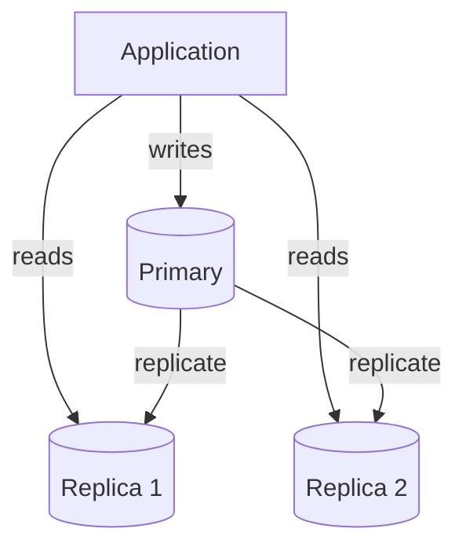
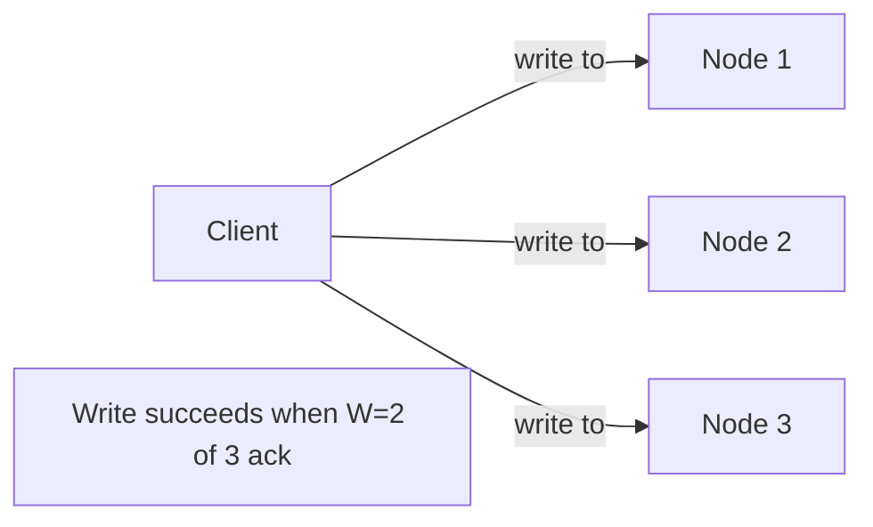
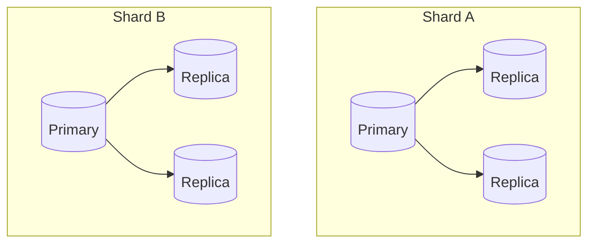

# Replication

Keeping copies of the same data on multiple nodes for fault tolerance,
read scalability, and geographic locality.

## Single-leader (primary-replica) replication

- All writes go to the primary; reads can be served by any replica.
- **Sync replication**: primary waits for replica ack before confirming
  write → strong consistency, higher write latency, replica failure can
  block writes.
- **Async replication**: primary confirms write immediately, replicates
  in background → low latency, but risk of data loss if primary fails
  before replicating, and reads from replicas may be stale (**replication
  lag**).
- **Semi-sync**: wait for at least one replica to ack (compromise).

**Failover**: if the primary dies, a replica must be promoted. Needs
leader election (e.g., via Raft/Paxos or a coordination service like
ZooKeeper/etcd) to avoid split-brain (two nodes both thinking they're
primary).

## Multi-leader replication
Multiple nodes accept writes (often one leader per datacenter/region),
and replicate to each other.
- **Pros**: writes can happen locally in each region (lower latency),
  tolerates a whole datacenter going down.
- **Cons**: write conflicts (two regions edit the same record
  concurrently) must be resolved — last-write-wins, vector clocks, or
  CRDTs (conflict-free replicated data types).

## Leaderless replication
Any node can accept reads/writes (e.g., Cassandra, DynamoDB). Uses
quorum reads/writes: write succeeds if **W** nodes ack, read succeeds if
**R** nodes respond, and if **W + R > N** (total replicas), you're
guaranteed to read the latest write (strong consistency achievable even
without a leader).

## Replication lag and its consequences
The gap between a write on the primary and its appearance on a replica.
Causes visible bugs like: a user posts a comment, refreshes, and it's
gone (read hit a lagging replica). Mitigations:
- Read-your-writes: route a user's own reads to the primary for a short
  window after they write (see [consistency
  models](../01-fundamentals/consistency-models.md))
- Monitor lag and remove badly-lagging replicas from the read pool

## Replication vs sharding — don't confuse them
- **Replication**: same data, multiple copies (for availability & read
  scale).
- **Sharding**: different data, split across nodes (for write scale &
  storage scale).
- Real systems combine both: each shard is itself replicated.

## Interview tip
When you say "we'll add read replicas," immediately address replication
lag and how stale reads are handled for the specific feature you're
discussing — this is a very common follow-up question.

## Related
- [Database indexing & sharding](database-indexing-sharding.md)
- [CAP theorem](../01-fundamentals/cap-theorem.md)
- [Consistency models](../01-fundamentals/consistency-models.md)