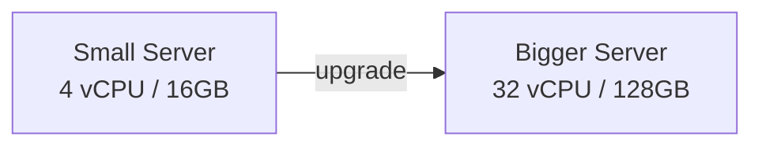
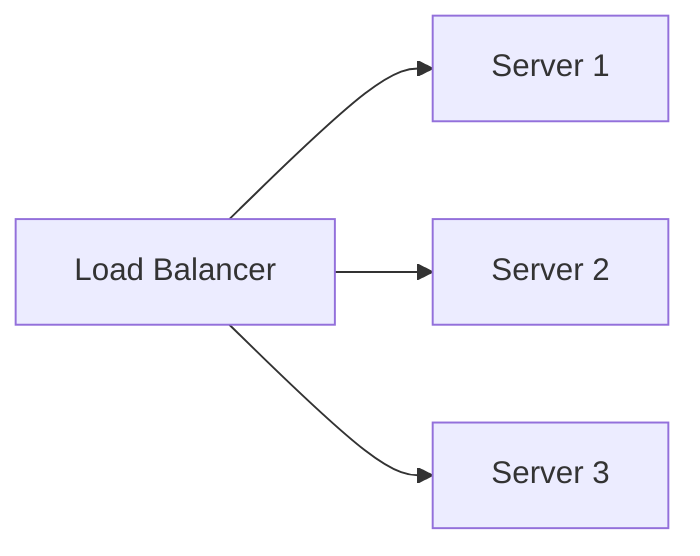

# Scalability

Scalability is a system's ability to handle growing load (users, data,
traffic) by adding resources, without a redesign.

## Vertical Scaling (Scale Up)
Add more power (CPU, RAM, disk) to an existing machine.

**Pros**
- Simple — no code changes, no distributed-systems complexity
- No data consistency issues (single node)

**Cons**
- Hard ceiling — there's a biggest machine you can buy
- Single point of failure
- Usually requires downtime to upgrade
- Cost grows non-linearly (bigger machines cost disproportionately more)

## Horizontal Scaling (Scale Out)
Add more machines and distribute load across them.

**Pros**
- No theoretical ceiling — keep adding nodes
- Better fault tolerance (one node dying doesn't take down the system)
- Can scale elastically with demand (cloud autoscaling)

**Cons**
- Adds complexity: load balancing, service discovery, distributed state
- Data consistency becomes harder (see [CAP theorem](cap-theorem.md))
- Needs stateless services (or careful state partitioning) to scale well

## Which to choose?
| Situation | Preferred approach |
|---|---|
| Early-stage startup, unpredictable load, fast iteration | Vertical first (simplicity), horizontal when it hits limits |
| High-traffic consumer product | Horizontal — required for real fault tolerance and scale |
| Stateful legacy database | Vertical scale up + read replicas, then sharding (horizontal) |
| Stateless web/API tier | Horizontal — trivial to add instances behind a load balancer |

## Key idea for interviews
Almost every "design X at scale" question wants you to identify **what
needs to scale** (read traffic? write traffic? storage? compute?) and
apply horizontal scaling at that specific layer — not just say "add more
servers" everywhere. State should be pushed out of application servers
(into caches/databases) so the app tier can scale horizontally and
statelessly.

## Related
- [Load balancing](../02-building-blocks/load-balancing.md)
- [Database sharding](../02-building-blocks/database-indexing-sharding.md)
- [CAP theorem](cap-theorem.md)