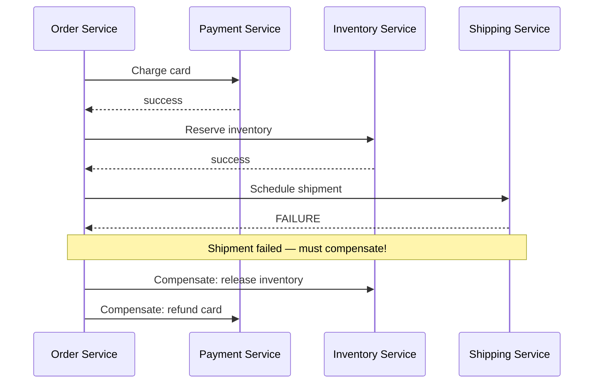
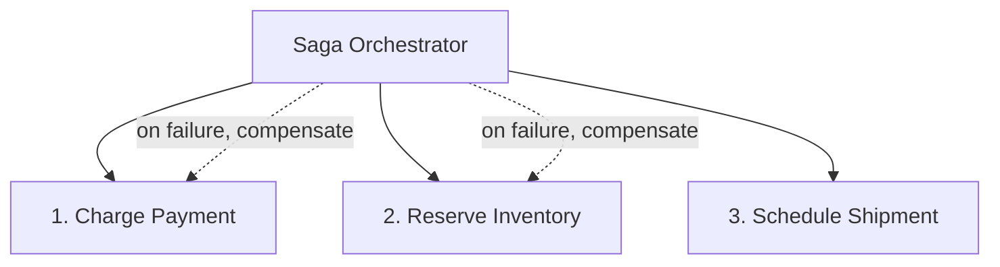

# Saga Pattern (Distributed Transactions)

## The problem
In a monolith, a multi-step business operation (e.g., "place an order")
can be one ACID database transaction — all-or-nothing. In
microservices, that same operation spans multiple services, each with
its **own** database — there's no single transaction to wrap them in.

## Two-Phase Commit (2PC) — why it's usually avoided
A coordinator asks all participants to "prepare" (lock resources), then
tells them all to "commit" once everyone confirms readiness.
- **Problem**: blocking — if the coordinator crashes mid-protocol,
  participants hold locks indefinitely; doesn't scale well; poor fit
  for the availability/latency goals of microservices. Rarely used
  across services in modern distributed systems.

## Saga pattern — the standard solution
Break the transaction into a sequence of local transactions, each in
one service, each with a **compensating transaction** to undo it if a
later step fails.

If any step fails, the saga runs compensating actions for every
**already-completed** step, in reverse order, to bring the system back
to a consistent (if not identical) state.

## Choreography-based saga
Each service listens for events and publishes its own — no central
coordinator (see [event-driven
architecture](event-driven-architecture.md)).
- **Pros**: simple for a small number of steps, no single point of
  failure/central dependency.
- **Cons**: hard to see the overall flow, harder to debug/monitor as
  the number of steps grows, risk of cyclic dependencies between
  services.

## Orchestration-based saga
A dedicated **saga orchestrator** service explicitly invokes each step
and handles failure/compensation logic centrally.

- **Pros**: clear, centralized view of the workflow; easier to add
  monitoring, retries, timeouts.
- **Cons**: the orchestrator is an additional service to build/maintain
  and becomes a critical dependency for the whole workflow.

## Important nuance: sagas are NOT truly atomic
Because each step commits independently, there's a window where the
system is in a partially-completed state (e.g., payment charged, but
inventory not yet reserved) — this is visible to other parts of the
system if they read that data during the window. This is why sagas
provide **eventual consistency**, not the strict isolation of ACID
transactions. Design compensating actions carefully — "undo" isn't
always literally possible (e.g., you can refund a payment, but you
can't un-send an email — compensations for irreversible actions
typically send a corrective follow-up, like a "sorry, cancelled" email
instead).

## Interview tip
Bring up sagas specifically when a case study involves a **multi-service
write** that must appear atomic to the user (e.g., booking a ride:
charge card + reserve driver + notify rider). Say explicitly which
steps have compensating actions and note the eventual-consistency
window — that level of detail is what separates a strong answer here.

## Related
- [Event-driven architecture](event-driven-architecture.md)
- [Ticketmaster case study](../05-case-studies/design-ticketmaster.md)
- [Uber case study](../05-case-studies/design-uber.md)